# Lec 01 - The Devices

The building blocks in digital circuit design are the silicon semiconductor devices, more specifically

1. the diodes
2. the MOS
3. bipolar transistors

In this lecture, or more specifically, in this course, we will focus more on the MOS, but will quickly cover the diodes and bipolar transistors.

## The Diode

Although diodes rarely occur directly in the schematic diagrams of present-day digital gates, they are still omnipresent. For instance, each MOS transistor implicitly contains a number of reverse-biased diodes. Diodes are used to protect the input devices of an IC against static charges. Also, a number of bipolar gates use diodes as a means to adjust voltage levels.

### Introduction

The diode to be discussed here is a **semiconductor&#x20;**_**pn**_**-junction**. The _pn_-junction diode is the simplest circuit element of the semiconductor devices. Figure 1.1a shows a cross-section of a typical _pn-_&#x6A;unction.

<figure>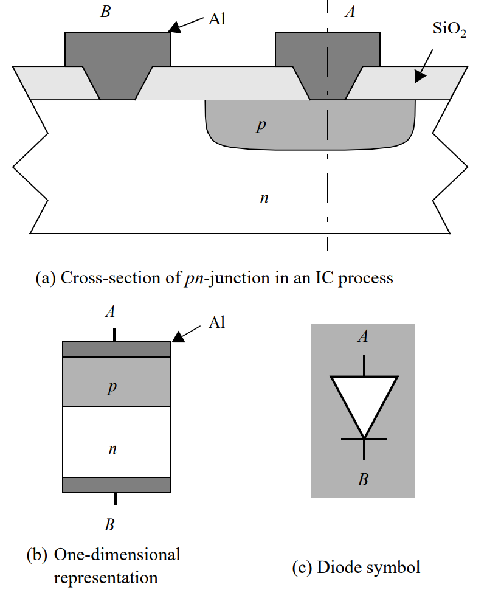<figcaption>
Figure 1.1 Abrupt pn-junction diode and its schematic symbol
</figcaption></figure>

* The _p_-type material is created by doping the silicon with _acceptor_ impurities (such as boron), which results in the presence of [**holes**](#user-content-fn-1)[^1] as the dominant or majority carriers.
* Similarly, the doping of silicon with _donor_ impurities (such as phosphorus or arsenic) creates an _n_-type material, where **electrons** are the majority carriers.

Aluminum contracts provide access to the _p-_ and _n-_&#x74;erminals of the device. The circuit symbol of the diode, as used in schematic diagrams, is introduced in Figure 1.1c.

<figure>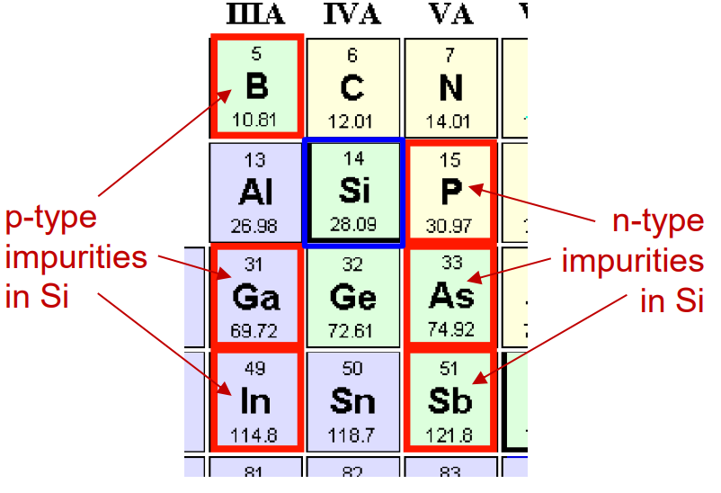<figcaption></figcaption></figure>


In a semiconductor, there are two types of charge carriers: **electrons** (with
&#x20;charge of -1.602×10-19 C) and **holes** (with charge of +1.602×10-19 C)


### Semiconductors

Unlike metal and insulator, a unique property of semiconductor is that
&#x20;impurities can be added (in a controlled manner) into it. This is called _doping_ and its purpose is:

* to make the material _n-_&#x74;ype or _p-_&#x74;ype, and
* to change the material's conductivity (or resistivity), usually is to **increase** the conductivity.

In other words, we are changing the conductivity by specifically making the material _n-type_ or _p-type_. For more about the chemistry side of doping, please go [here](lec-01-the-devices.md#holes-and-electrons).


**Increasing** a material's **conductivity** is equivalent to **decreasing** its **resistivity**.


### Origin of Current

In electronics, current is just the movement of charged particles (electrons or holes). This movement happens in two main ways: **Drift** and **Diffusion**.

<figure>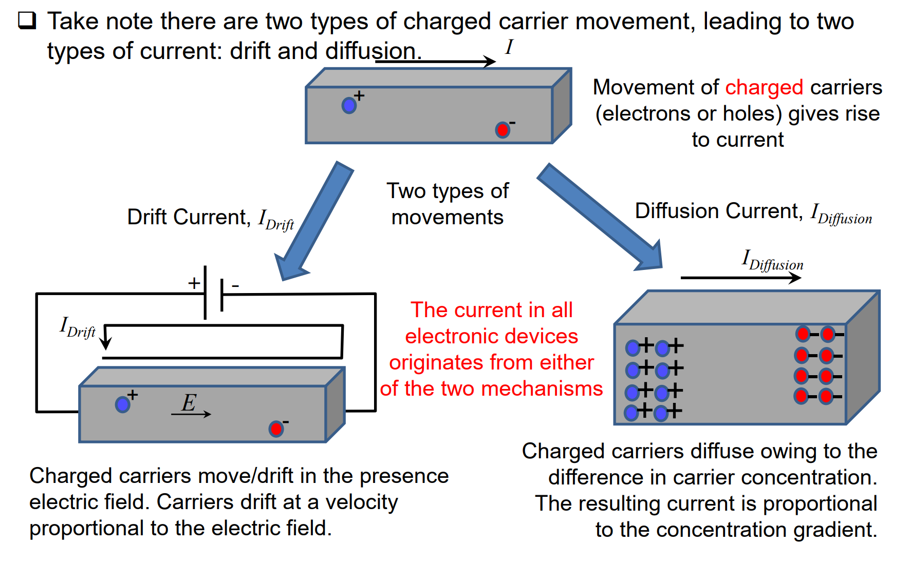<figcaption></figcaption></figure>



#### Drift Current

As explained clearly in the image. There is an external electric field to drive the movement of the electrons and holes to the equilibrium.



#### Diffusion Current

Diffusion happens whenever something spreads out from where it’s concentrated to where it’s not, e.g., from high concentration to low concentration. In other words, diffusion is driven by the **difference in concentrations**, or the **concentration gradient**.

**Analogy**: recall that when we drop an ink into the water, it will start diffusing until it reaches a static state. Similarly here, under the **diffusion**, there is no external force, the holes and electrons will spontaneously move to the correct region to reach the equilibrium.




The current in all electronic devices originates from either of these two mechanisms.


#### Origin of Current in different devices

Below is the table summarizing the carrier movement in different devices

| Devices                     | Movement Mechanism in on-state | Type of Carriers                                                                |
| --------------------------- | ------------------------------ | ------------------------------------------------------------------------------- |
| Resistor                    | Drift                          | <ul><li>Electrons (Metal)</li><li>Electrons and holes (Semiconductor)</li></ul> |
| Diode                       | Diffusion                      | <ul><li>Electrons and holes</li></ul>                                           |
| Bipolar Junction Transistor | Diffusion                      | <ul><li>Electrons and holes</li></ul>                                           |
| MOSFET                      | Drift                          | <ul><li>Electrons (NMOS)</li><li>Holes (PMOS)</li></ul>                         |

### Operation

Diode (semiconductor pn-junction) is the simplest (2-terminal) and most
&#x20;fundamental **nonlinear** circuit element.

* It allows a current flow through it easily **in one direction** (known as the [forward
  &#x20;direction](lec-01-the-devices.md#forward-bias), V > 0), but **not in the opposite direction** (known as the [reverse direction](lec-01-the-devices.md#reverse-bias), V < 0), **except for the reverse** [**breakdown region**](lec-01-the-devices.md#breakdown-region)**.** This is unlike a resistor, which is a linear element that has a linear current-voltage relation.
* Diode can be used as a **switch** and in a **rectifier** circuit to convert AC into DC. (CG1111A!)

#### Forward Bias

<figure>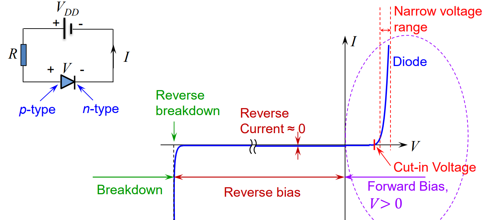<figcaption></figcaption></figure>

* Under **forward-bias** (V > 0), an external voltage is applied such that the _p-_&#x74;ype terminal is at a **higher** (positive) voltage with respect to the _n-_&#x74;ype terminal.
* The forward current flows through the diode from the _p-_&#x74;ype side to the _n-_&#x74;ype side.
* The forward current remains small (around 0 practically) until the **cut-in voltage** is reached. It then increases quickly with a small increase in the voltage V thereafter.
* With a substantial forward current, the **voltage drop** across the diode lies in a narrow range. In other words, the voltage drop almost remains constant.

#### Reverse Bias

<figure>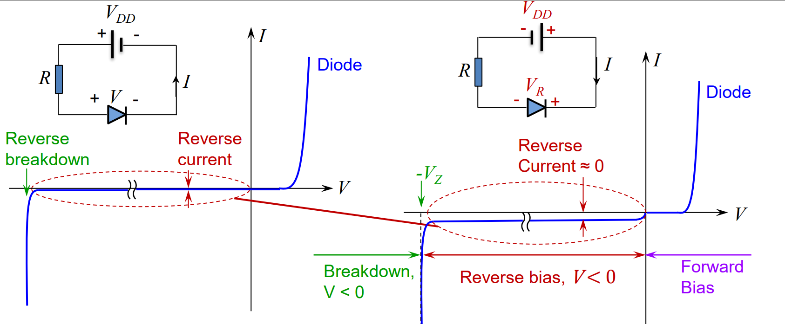<figcaption></figcaption></figure>

* Under **reverse-bias**, the voltage at _p-_&#x74;ype is lower than the voltage at _n-_&#x74;ype.
* The reverse current (around 0) flows through the diode from the _n-_&#x74;ype sied to the _p-_&#x74;ype side.
* For reverse bias voltage magnitude, |V| = VR < VZ (VZ is the **breakdown voltage**), the reverse current is very small and can be treated practically as **zero**, meaning the diode is equivalent to an **open circuit**.

#### Breakdown Region

<figure>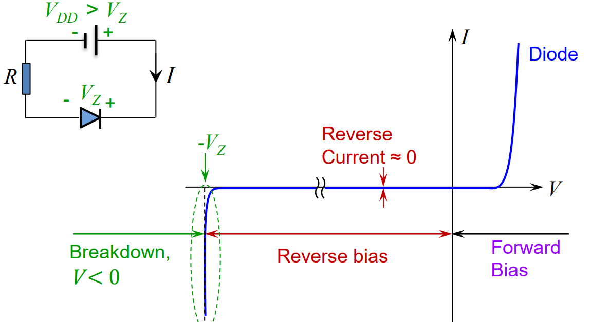<figcaption></figcaption></figure>

* Current, while operating in the breakdown region, can be limited by connecting a resistor, $$R$$, of suitable value in series with the $$pn$$ junction diode. ($$I=\frac{V_{DD}-V_Z}{R}$$)
* Operation in the breakdown region does not destroy the diode, provided the current through it is kept below a certain level (because of the resistor in this circuit), such that the power dissipation ($$V×I$$) is below what the diode can handle.

### More under the hood

As we have mentioned above, the _pn-_&#x6A;unction or the diode is **most fundamental** circuit element. We can also find _pn-_&#x6A;unction in the MOSFET transistor. So, it will be good to know what's happening underneath the hood.

#### Holes and Electrons

The main carrier in _n-_&#x74;ype material is **electron** while in _p-_&#x74;ype material is **hole**. But we should know that in whatever material, **only** the **electrons** can move freely, and the movement of electrons will cause the "effect" of **holes** are moving also, but actually the movement of holes is caused by the movement of **electrons**.

Both _n_-type and _p-_&#x74;ype material are neutral, by which I mean inside each material, the number of electrons and the number of **protons** are the same. The underneath principle is that:




<strong>p-type — holes</strong>

<figure>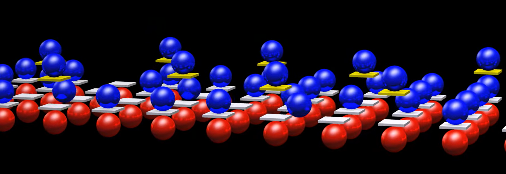<figcaption></figcaption></figure>

In _p-_&#x74;ype material, a new intermediate **energy-level** is created (<mark style="color:yellow;">yellow plate</mark> in the image above) slighly above the energy level which is below the gap so that the electrons (<mark style="color:blue;">blue spheres</mark> in the image above) will move up, leaving behind the [**holes**](#user-content-fn-2)[^2] in the lower energy level, making the electrons at the lower energy level free to move around. This can be seen as the **holes** moving around.


We move some of the **original electrons** above the yellow plate. And the number of protons and electrons still remain the same.





<strong>n-type — electrons</strong>

<figure>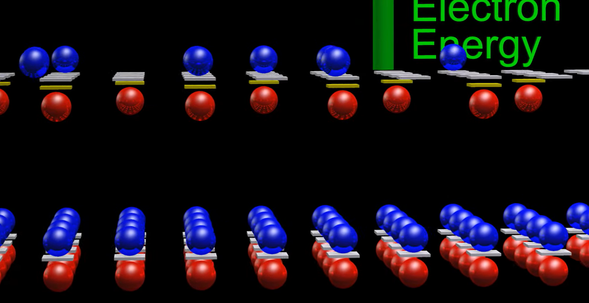<figcaption></figcaption></figure>

In _n-_&#x74;ype material, this new intermediate energy level (<mark style="color:yellow;">yellow plate</mark> in the image above) is created at the energy level above the gap. And at this level, the electrons (<mark style="color:blue;">blue spheres</mark> in the image above) can flow freely.


Here, both **new protons and electrons** are created together so that number of protons and electrons are still the same.





Here, the height only shows the **energy level** of the **electrons**, not protons. The higher the level is, the higher energy the electrons at that level has.


The electrons moving at the **energy level** which is above the gap **will and only will** recombine with the holes at the **energy level** which is below the gap.

What does the gap here mean?

Just a quick recap about what the gap means. The gap is called the **band gap**. Basically, the bigger the gap is, the less conductive the material is. In the semiconductor material, the gap is relatively small. Even the gap is small, if we don't **dope** the semiconductor material, in other words, creating the above yellow plate, it's hard for the electrons to continuously moving freely in the semiconductor material.

* For _n-_&#x74;ype material, the yellow plate is called **donor energy level**.
* For _p-_&#x74;ype material, the yellow plate is called **acceptor energy level**.

By themselves, a piece of N-type or P-type silicon is just a resistor (a material that conducts electricity). The magic that makes all modern electronics work happens when we join them together to form a _pn-_&#x6A;unction. This is what creates the special properties of a diode, a transistor, and every computer chip.

The process to create this kind of <mark style="color:yellow;">yellow plate</mark> is called **doping**. But given that, it is still a bit blur to some of you maybe. So, let's use the high school knowledge to further explain what is doping.



#### Conductor

We know that some materials are good conductors, for example, **copper**. But why are they good conductors? It is because by looking at copper's atomic structure, we see that it has a **single electron** in its **outermost shell**.

<figure>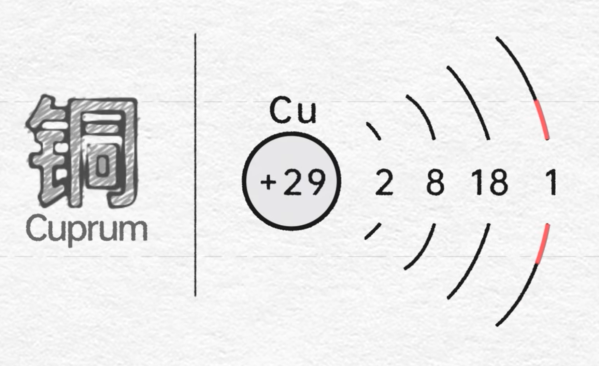<figcaption></figcaption></figure>

Suppose our wire is made up of copper. When a power source is applied, this free electron in the copper, under the influence of the **external electric field**, will move in a specific direction, thus producing an electric current.

<figure>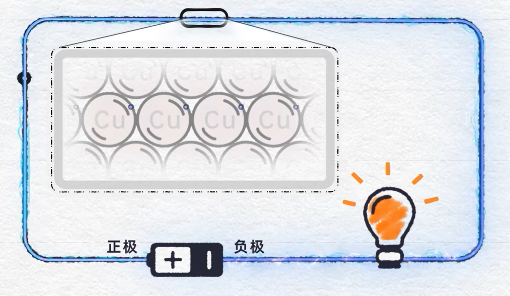<figcaption></figcaption></figure>




#### Semiconductor

There is a type of material whose **conductivity** lies between the conductor and the insulator. One example is the **silicon** and its atomic structure is shown as follows,

<figure>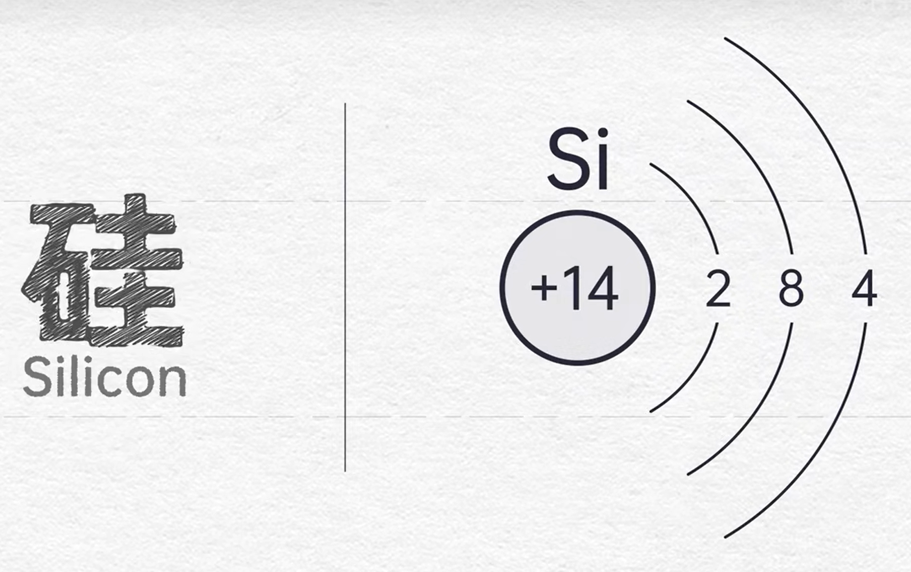<figcaption></figcaption></figure>

Silicon's outermost shell can actually hold 8 electrons, but one silicon atom only has 4 at its outermost shell. If we place multiple silicon atoms together, we will find that one silicon atom can share electron pairs with its four surrounding silicon atoms, forming **covalent bonds**. This is a very **stable** structure, which binds the electrons very strongly. Therefore, silicon's **conductivity** is very **weak** in this state.

<figure>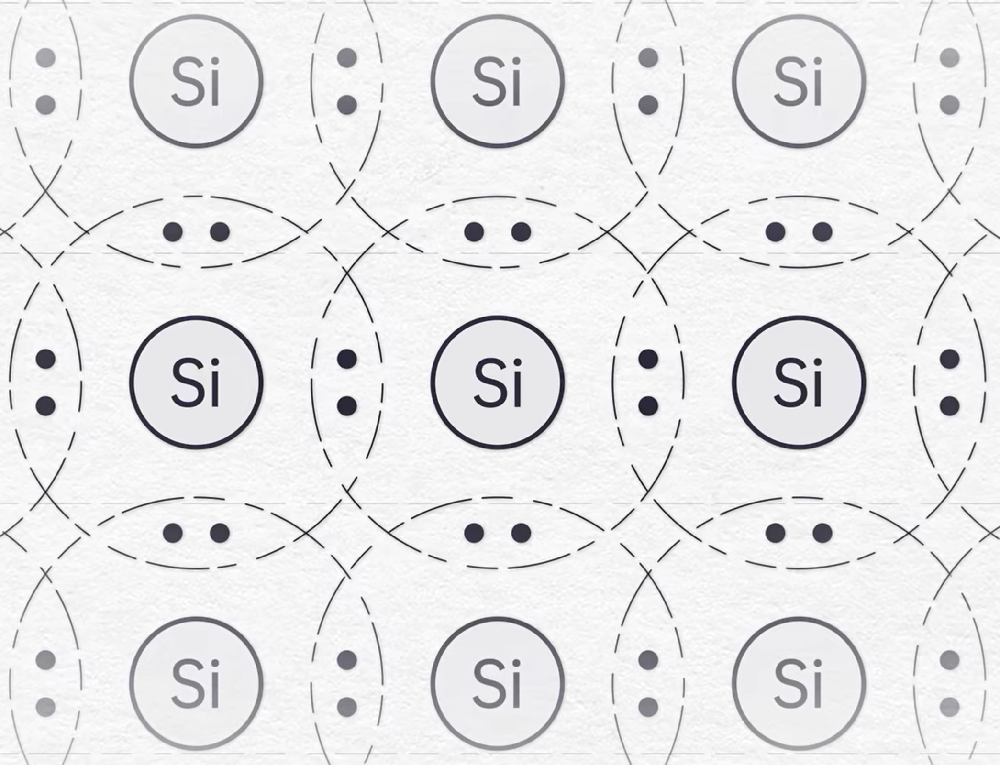<figcaption></figcaption></figure>



#### N-type Doping

But if we dope silicon with the element **phosphorus** (which is element #15), phosphorus has 5 electrons in its outermost shell, four of which can form **covalent bonds** with four silicon electrons. The remaining one acts as **a free electron**, which increases the conductivity of the new material. This type of doping is called _**n-**_**type doping**. Therefore, in _n-_&#x74;ype material, the charge carriers are **electrons**.

<figure>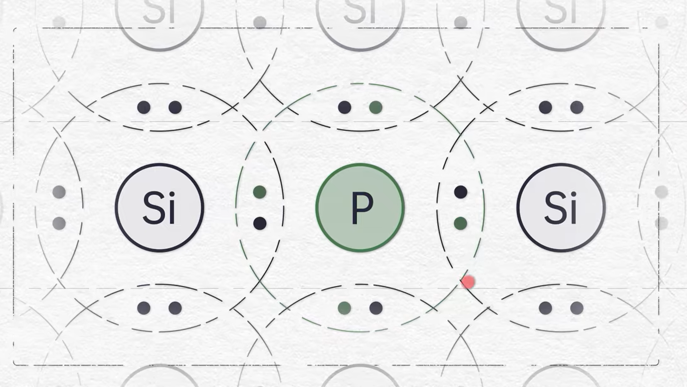<figcaption></figcaption></figure>



#### P-type doping

Similarly, if we dope silicon with the element **Boron** (which has 3 valence electrons), Boron's 3 outermost electrons can form **covalent bonds** with silicon, but this leaves an incomplete bond, which forms a **hole**. However, other electrons can move into this hole. Because another electron moved in, it is equivalent to the hole moving to a different location. At this point, the conductivity of this boron-doped silicon will also increase, and this type of doping is called _p-_&#x74;ype doping. Therefore, in _p-_&#x74;ype material, the charge carriers are **holes**.

<figure>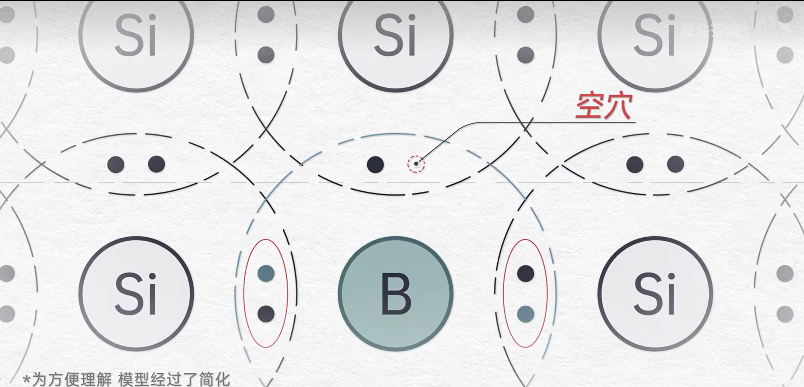<figcaption></figcaption></figure>



Now we have seen the basic structure of _n-_&#x74;ype and _p-_&#x74;ype material. Let's see some interesting things when we put them together, which is to form the _pn-_&#x6A;unction.

#### Depletion region

In the connection between the _n-_&#x74;ype material and _p-_&#x74;ype material, the excessive and **diffused** electrons from the _n-_&#x74;ype flows to the _p-_&#x73;ide and recombine with the excessive **holes** in the _p-_&#x74;ype side. As a result, some charge carriers (free electrons for the _n-_&#x74;ype material and holes for the _p-_&#x74;ype material) are depleted in the region around the junction interface, so this region is called the **depletion region**.


Recall that in diode/_pn-_&#x6A;unction, current is formed because of **diffusion**.


#### Diffusion in Diode

The depletion region is **charged** because the **diffusion** described above will cause the _p-_&#x73;ide to have **more electrons** thus showing **negative charge** and the _n-_&#x74;ype side to have **less electrons** thus showing **positive charge**. This creates an **electric field** pointing from the positive charge area to the negative charge area, thus providing a force **opposing** the charge **diffusion**. When the electric field is sufficiently strong to cease further diffusion of holes and electrons, the depletion region reaches the equilibrium.

<figure>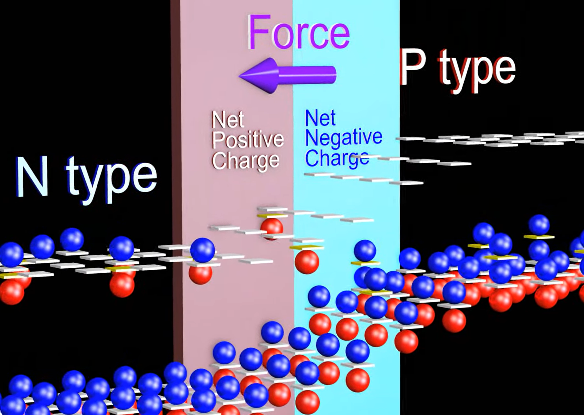<figcaption></figcaption></figure>

#### Forward and Reverse Bias combined with Diffusion

If we apply **lower voltage** at the _n-_&#x73;ide, the external electric field will cancel out the inner electric field, thus the depletion region will be **decreased** and the external field will help the movement of the electrons, making it easier for the electrons to move from _n-_&#x73;ide to _p_-side. This is called **forward bias**,

<figure>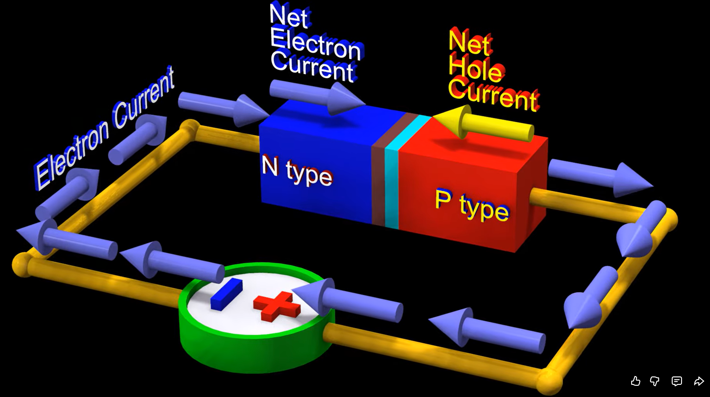<figcaption></figcaption></figure>

Similarly, if we apply higher voltage at _n-_&#x73;ide, the external electric field will reinforce the inner electric field, thus **increasing** the depletion region, making it harder for the electrons to move from _n-_&#x73;ide to _p_-side. This is called **reverse bias**.

<figure>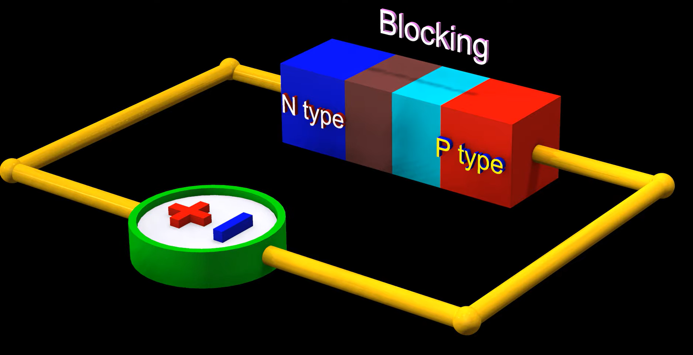<figcaption></figcaption></figure>

## BJT

### Introduction

<figure>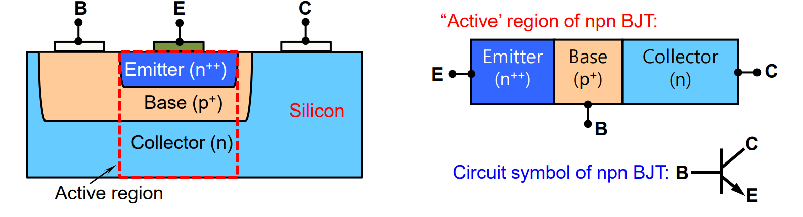<figcaption></figcaption></figure>

* Bipolar junction transistor (BJT) is a **3-terminal** device made using a single crystal semiconductor (typically silicon), just like the pn-junction diode.
* BJT is made with **3 doped semiconductor regions**, namely **emitter**, **base** and **collector**, corresponding to the 3 terminals.
* The "active" region of the BJT is the region under (and including) the **emitter**.
* BJT is not a symmetrical device, in particular, impurities added to the **emitter** is at a much higher concentration than that added to **collector**.

### Modes of Operation

The Bipolar Junction Transistor (BJT) has two **pn-junctions**: the emitter-base junction and the collector-base junction. Each of these junctions can be either **forward biased** or **reverse biased**. However, we will not focus on the BJT, as it is not used in CMOS logic circuits.

## MOSFETs

The metal-oxide-semiconductor field-effect transistor (MOSFET, or MOS, for short) is certainly the workhorse of contemporary digital design. Its major asset, from a digital perspective, is that is performs very well as a **switch** with an **infinite off-resistance** (for |VGS| < |VTH|) and a **finite on-resistance** (for |VGS| < |VTH|).

<figure>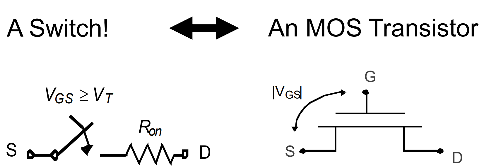<figcaption></figcaption></figure>

Before moving on, let's make some conventions

1. For MOSFETs, S denotes **Source**, D denotes **drain**, G denotes **gate**, and B denotes the **body** or subtrate terminals.
2. For simplicity, we assume body (substrate) is shorted to source terminal.
3. **Source** and **drain** are physically **symmetrical**.
4. Majority charge **carriers** move **from source to drain**.
5. VGS: **Gate to source** voltage. Or the difference between gate voltage and source voltage. (Treat it as a vector in math, so VGS=-VSG)
6. VDS: **Drain to source** voltage.
7. VDD: Supply voltage.
8. VT: Threshold voltage.

### Introduction

There are two types of MOSFET: n-channel and
&#x20;p-channel MOSFETs. Or to put it simply, just NMOS and PMOS.

<figure><figcaption></figcaption></figure>

* An **n-channel** MOSFET or NMOS is made using a _**p-**_**type** single-crystal silicon **substrate**.
* Heavily doped _**n**__**+**__**-**_**type** regions, created in the substrate, form the **source** and **drain** regions.
* The metal or polysilicon electrode on top of the thin oxide (dielectric) layer, between the **source** and **drain** regions, is called the **gate**.
* Note that MOSFET has a fourth terminal, which is the **substrate** or **body**.
* **Source terminal** is the **source of the carriers** that will flow through the channel to the **drain terminal**.
  * **Analogy**: In NMOS, we can think the **drain terminal** as something that sucks the **electrons** from the source (ground) to the drain. We will use this analogy in the later parts also.

### Physical Structure

<figure>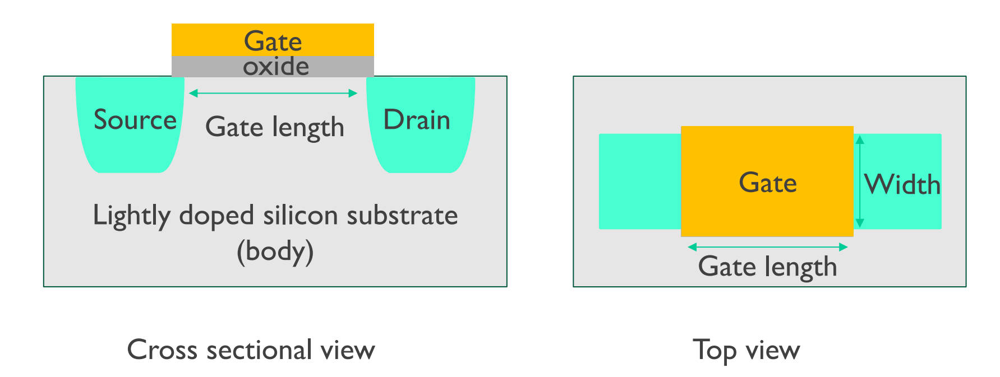<figcaption></figcaption></figure>

* **Substrate (body)**: Lightly doped
* **Source, Drain**: Heavily doped charge wells; symmetric
* **Gate oxide (dielectric)**: Insulator between gate and channel
* **Gate**: Controls the charge flow (creates the field effect)
* **Gate length**: the distance between the **source** and **drain** regions under the gate


{% column width="50%" %}
<figure>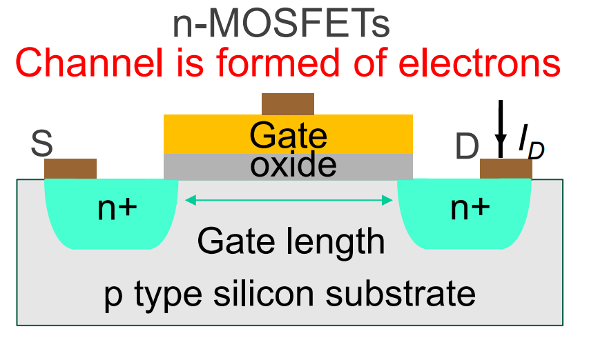<figcaption></figcaption></figure>

* _n-_&#x74;ype source/drain
* _p-_&#x74;ype body (substrate)
* **Electrons** flow from source to drain
* Current flows from **drain to source**
* We can memorize it using "npn".

<figure>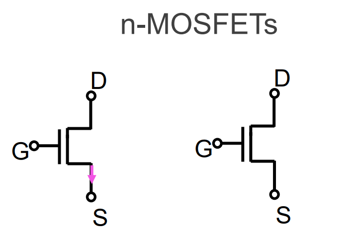<figcaption></figcaption></figure>

* Source and body are usually connected to ground (0V)
* VT is **positive**.
* When VGS $$\geq$$ VT, device is on.
* Linear region of operation: 0 < VDS < VGS - VT
* VDsat = VGS - VT


{% column width="50%" %}
<figure>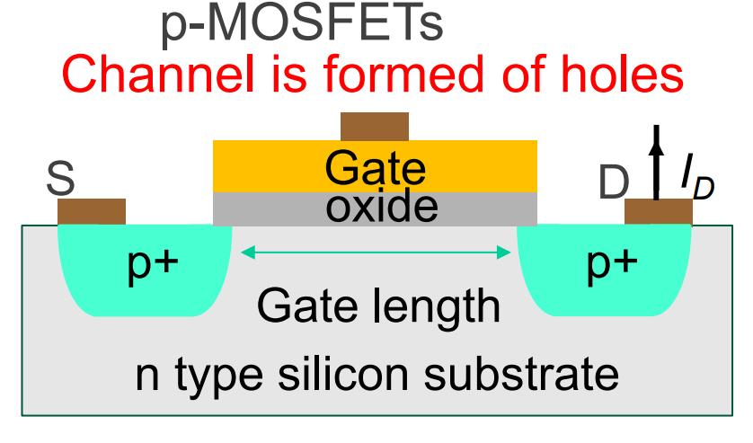<figcaption></figcaption></figure>

* _p-_&#x74;ype source/drain
* _n-_&#x74;ype body (substrate)
* **Holes** flow from source to drain
* Current flows from **source to drain**
* Similarly, we can memorize it using "pnp"

<figure>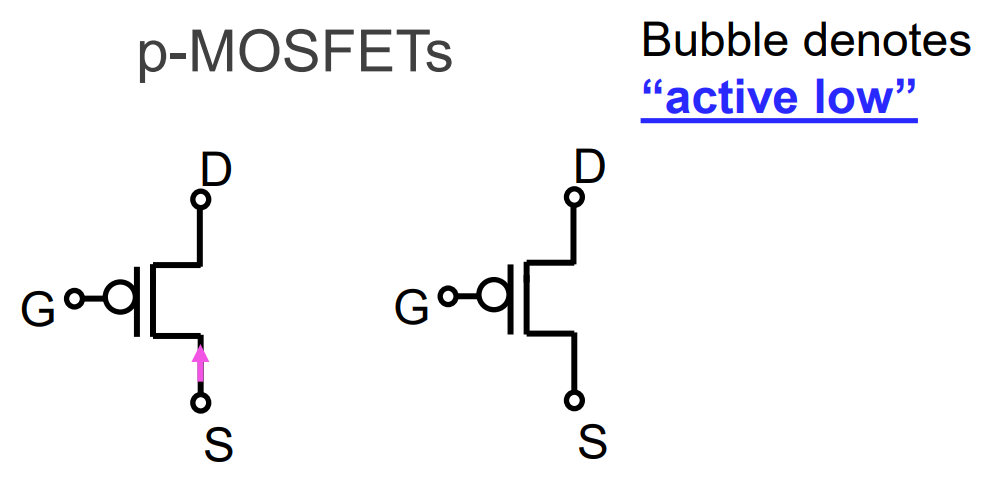<figcaption></figcaption></figure>

* Source and body are usually connected to VDD
* Drain is **not** usually connected to ground (0V).
* VT is **negative**.
* When VGS $$\leq$$ VT, device is on.
* Linear region of operation: 0 > VDS > VGS - VT
* VDsat = VGS - VT




#### Notes

1. The threshold voltage, VT, is the gate-source voltage at which channel is formed.
   1. The **channel** in a MOSFET is the path that allows current to flow between the source and the drain — under the gate oxide layer. It forms inside the semiconductor substrate (usually silicon) when we apply a voltage to the gate.
2. For the sake of simplicity, we made the following rules when analyzing the MOSFET.
   1. NMOS and PMOS are ON when the |VGS| > |VTH| and OFF when |VGS| <i class="fa-less-than-equal">:less-than-equal:</i> |VTH|
   2. If we increase |VGS|, the channel will become wider, thus the output current ID will increase.
   3. For the determine the **linear region** or the **saturation region**, we must strictly following the following table.


<figure><figcaption></figcaption></figure>


We can understand the condition for the NMOS and then flip all the signs when dealing with PMOS.


For the sake of simplicity, in this course, we will use NMOS as an example. And thus the following sections will be based on NMOS. The PMOS equivalent will be left as an exercise to the reader.

### Modes of Operations

We may notice that between the **source**, **drain** and the **subtrate**, there are always _**pn**_**-junctions** (<mark style="color:purple;">purple area</mark> in the image below in this section). This is very important and it affects how our electrons can move.

#### Cut-off

We start when VGS = 0 -> no **channel** is formed for VDS $$\geq$$ 0 -> No current flow.

<figure>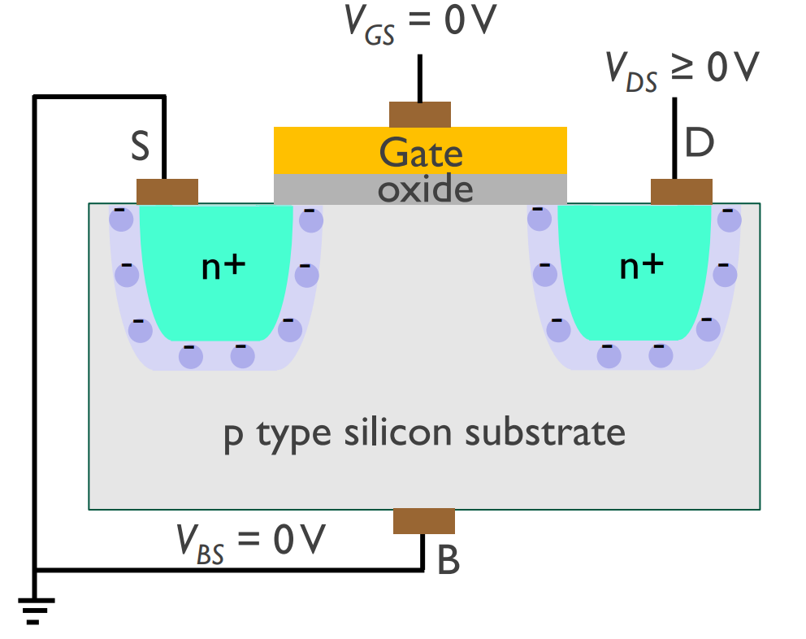<figcaption></figcaption></figure>

#### In between cut-off and linear

We then increase VGS unilt VGS = VTH.

<figure>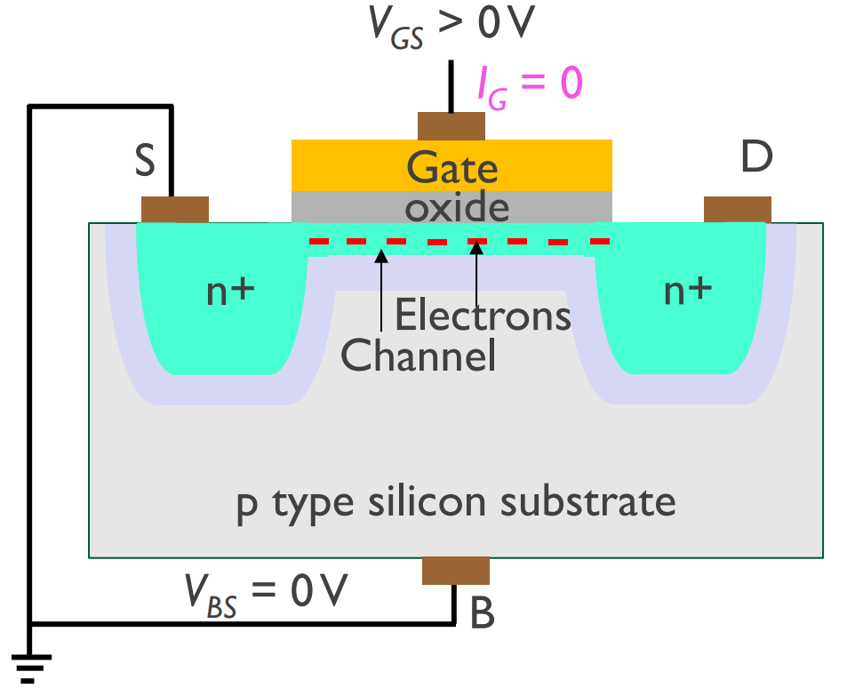<figcaption></figcaption></figure>

So what happens physically is that: At this point of time, **n-channel** is formed between source to drain. This is because as we increase VGS, and with the **existence of the insulator (oxide),** the high voltage applied at VGS pushes away more holes and **attracts more electrons** to pile up near the surface of the subtrate under the gate. So the surface of **p-subtrate** effectively becomes **n-type** and is said to be **inverted** leading to formation of **n-channel**. The gate voltage at which this inversion happens is called **Threshold voltage, V****TH****.** As you may notice, below the newly formed **n-channel**, the new _pn-_&#x6A;unction is formed, but in this case, it is in the **reverse-biased** state.

#### Linear

After that,

1. we continue increasing VGS until it is bigger than VTH. And then we stop increasing VGS and fix it.
2. Then we slowly increase VDS but it shouldn't exceed VGS-VTH.

So now, as VDS > 0, and there is an **n-channel** in between source and drain, as we have written above, the current will flow **from drain to source**.

<figure>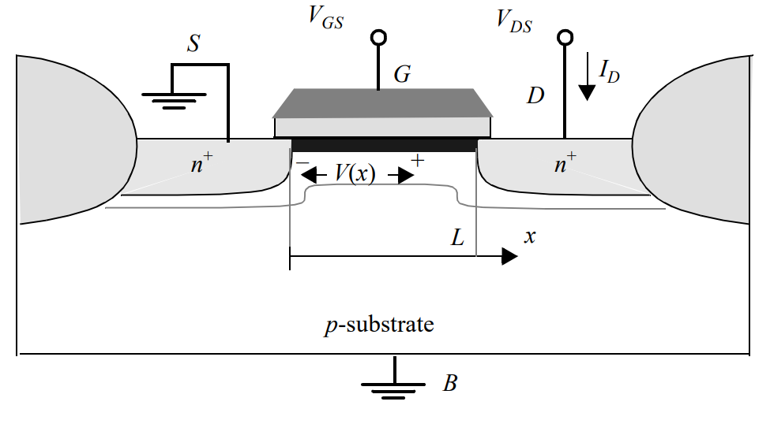<figcaption></figcaption></figure>

At point x along the channel, the voltage is V(x), and the gate-to-channel voltage at that point equals VGS - V(x). We assume that under linear region, this voltage **exceeds** the **threshold voltage** all along the channel. So again, what happens physically here is that:&#x20;

* Within the NMOS, a conductive **n-type channel** is formed between the **source** and **drain**.
* When VDS​ (drain-to-source voltage) is small, the entire channel is uniformly formed — electrons can move easily.
* As VDS​ increases slightly, the **electric field** pushes more electrons, and **current I****D****​** increases **proportionally** (Ohm's law). This is valid only for **small values of V****DS**.
* This is called **linear region** or **resistive region** of a MOSFET.


"Region" means a range of VGS and VDS values where the MOSFET shows a specific physical behavior and current-voltage or I-V relationship.


#### In between linear and saturation

Now, as we have already fixed the VGS and start increasing the VDS, we increase VDS until VDS = VGS-VTH. As the value of drain-source voltage VDS is further increased, the assumption that the channel voltage is larger than the threshold all along the channel ceases to hold. This happens when VGS - V(x) < VTH. At that point, the induced charge is zero, and the conducting channel disappears or is **pinched-off**.

<figure>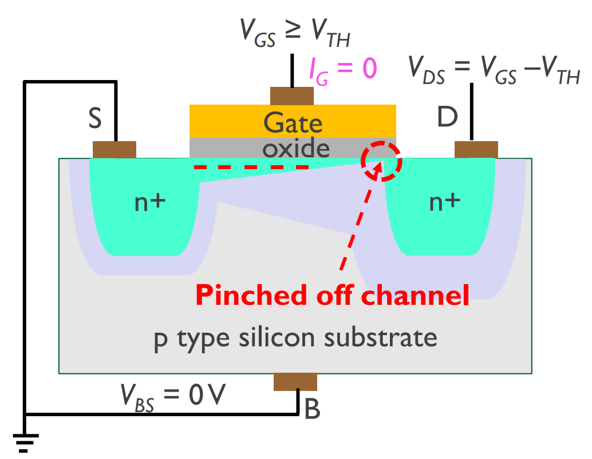<figcaption></figcaption></figure>

So, what happens physically now? The effective voltage between gate and source VGD = VG - VD = VGS - VDS (As VS = 0) = VGS - (VGS - VTH) = VTH. Then the channel at drain end begins to **pinch off**.


Using the sucking analogy on the drain side, we can think of it as when we increase VDS, the drain will suck the electrons **more quickly**, thus the channel near to the drain will become **thinner**. As the drain cosumes the electrons that the source provided, this is also why the source pin is called source and the drain is called drain.


#### Saturation

As we continue increasing VDS until VDS > VGS - VTH. Let's denote three variables here:

1. $$L$$ is the channel length
2. $$\Delta L$$ is pinched-off channel length
3. $$L_{\text{eff}}$$ is the effective channel length = $$L-\Delta L$$

<figure>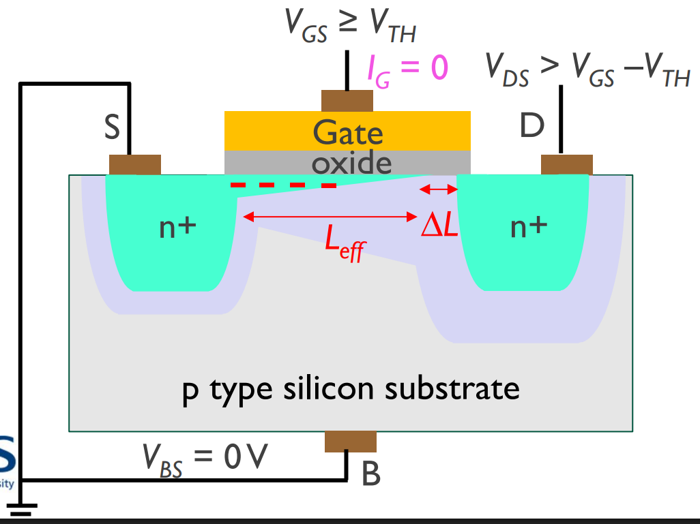<figcaption></figcaption></figure>

So, what happens physically? Although the channel at the drain end pinches off, the electrons still flow to drain under the influence of **high electric field in the pinch-off region** from drain to source and hence the **current is constant**.


Here, in the **pinched-off** region near the drain, there is still **n-channel**, it's just that it is very **thin**, it doesn't mean that there is no **n-channel**.


What are the short channel effects?

Basically, when transistors get **very tiny**, the gate **loses some control** over the channel, and new unwanted effects appear — those are called **short-channel effects (SCEs).**

***

In summary, we have the following table summarizing the above 5 stages of NMOS.

| Condition / VDS Range                                    | Region                                     | Channel Description                                                                 | Current Behavior / Equation                                           |
| -------------------------------------------------------- | ------------------------------------------ | ----------------------------------------------------------------------------------- | --------------------------------------------------------------------- |
|  $$V_{GS} < V_{TH}$$                                     | **Cutoff (OFF)**                           | No inversion channel formed; MOSFET is OFF                                          |  $$I_D \approx 0$$                                                    |
| $$V_{GS} \approx V_{TH}$$                                | **Boundary between Cutoff and Linear**     | Channel **just starts to form** (weak inversion); small leakage current begins      | $$I_D$$ rises exponentially with $$V_{GS}$$ (subthreshold conduction) |
| $$V_{GS} > V_{TH}$$ and $$0 < V_{DS} < V_{GS} - V_{TH}$$ | **Linear (Ohmic)**                         | Channel fully formed and uniform; acts like voltage-controlled resistor             | $$I_D =f(V_{DS}, V_{GS})$$                                            |
| $$V_{DS} = V_{GS} - V_{TH}$$                             | **Boundary between Linear and Saturation** | Channel begins to pinch off at the drain end                                        | Marks start of current saturation                                     |
| $$V_{DS} > V_{GS} - V_{TH}$$                             | **Saturation (Active)**                    | Channel pinched off near drain; current nearly constant (independent of $$V_{DS}$$) | $$I_D =f(V_{GS})$$                                                    |

In NMOS, why the current only flows from drain to source?

We can think of the three possible routes that the current might flow:

1. **Gate to other places**: This is **not possible** as there is an insulator material (oxide) between gate and source, drain and subtrate)
2. **Source to body**: This is **not possible** as the source and body are both connected to ground (0V). And because of the existence of the **depletion region**. No voltage difference plus the depeltion region, the current cannot flow from source to body.
3. **Drain to body**: As body is 0V and drain is connected to **positive voltage**, because of the **reverse-bias** property of the _pn-_&#x6A;unction, the current cannot flow from drain to body. And as you increase VDS, the depletion region can only become bigger and bigger, making it even more impossible for the current to flow from the drain to the body.

### I-V characteristics

#### Output characteristic



#### Linear Region

In the linear region, we have two situations

* Increase in VDS leads to increase in current like **voltage-controlled resistor**.
* Increase in VGS leads to a greater number of electrons leading to higher current.

That's why $$I_D =f(V_{DS}, V_{GS})$$, and the function $$f$$ is

$$
i_D = \mu_n C_{ox} \frac{W}{L} \left[ (V_{GS} - V_T)V_{DS} - \frac{1}{2}V_{DS}^2 \right] \\
$$

where

$$
\begin{align*}
\mu_n      & \quad \text{is the electron mobility in the channel} \\
C_{ox}    & \quad \text{is the Gate oxide capacitance per unit area} \\
W         & \quad \text{is the Channel Width} \\
L         & \quad \text{is the Channel length}
\end{align*}
$$

Based on this equation, we see that $$I_D$$ doesn't increase **perfectly** linearly with $$V_{DS}$$. Only when $$V_{DS}$$ is very small -> $$\frac{1}{2}V_{DS}^2$$ is very negligible -> we can say the increasing is **linear**.


The linear region is where the digital integrated design comes in.




#### Saturation Region

In the saturation region, only the increase in VGS will affect the current. We denote VDsat = (VGS - VT).

<figure>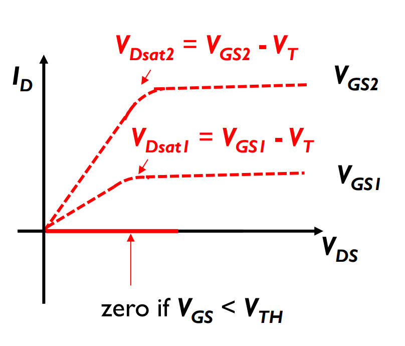<figcaption></figcaption></figure>

That's why we have $$I_D =f(V_{GS})$$, and the function $$f$$ is

$$
i_D = i_{Dsat} = \frac{1}{2}\mu_n C_{ox} \frac{W}{L} (V_{GS} - V_T)^2
$$

where,

$$
\begin{align*}
\mu_n      & \quad \text{is the electron mobility in the channel} \\
C_{ox}    & \quad \text{is the Gate oxide capacitance per unit area} \\
W         & \quad \text{is the Channel Width} \\
L         & \quad \text{is the Channel length}
\end{align*}
$$


The saturation region is where the analog integrated design comes in.




In summary, below is the NMOS and PMOS I-V characteristics (iD and VDS), where the red cicrled part is the **linear region** and the green circled part is the **saturation region**. This is called **output characteristics**, where ID versus VDS with VGS as a parameter.

<figure>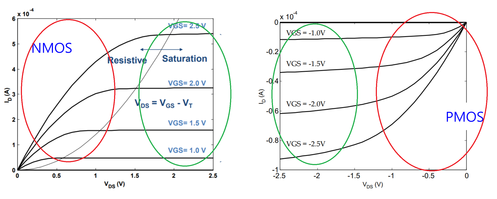<figcaption></figcaption></figure>

#### Transfer characteristic

If we draw the I-V characteristics between the VGS and iD, we will find that after VGS exceeds beyond VTH, iD will increase **quadratically** as VGS increases. This is called **transferred characteristics**, where iD versus VGS at a given fixed VDS value (VDS is chosen so that the MOSFET is in **saturation region**).

<figure>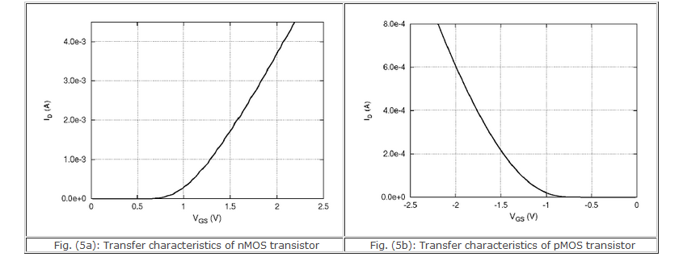<figcaption></figcaption></figure>

So, to understand its geometric meaning, we can see from the following graph,

<figure>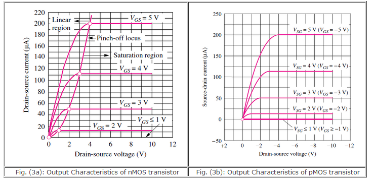<figcaption></figcaption></figure>

### New Transistor Architecture

As for now, we only have one gate to control the channel. Nowadays, the new transistor architecture is called 3D FET.

<figure>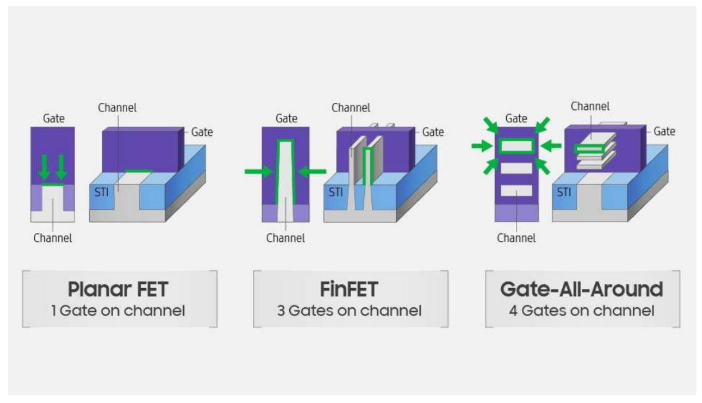<figcaption></figcaption></figure>

For example, the following is the diagram showing the **height**, **width** and **length** of FinFET and Gate-All-Around.

<figure>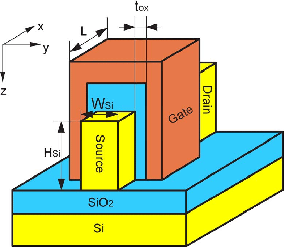<figcaption>
FinFet length, width and height
</figcaption></figure>

## Homework

### Some awesome videos

Great thanks to my tutor **juezhao**, the following two videos from YouTube explains perfectly on everything under the hood, from the movement of electrons to the _pn-_&#x6A;unction and then to the MOSFETS.





Besides the above, the following video from Bilibili is also awesome!



### PMOS

In NMOS, we have seen that the gate is connected to a **positive voltage** and the source and body are connected to **ground** or **negative voltage**, as shown as follows,

<figure>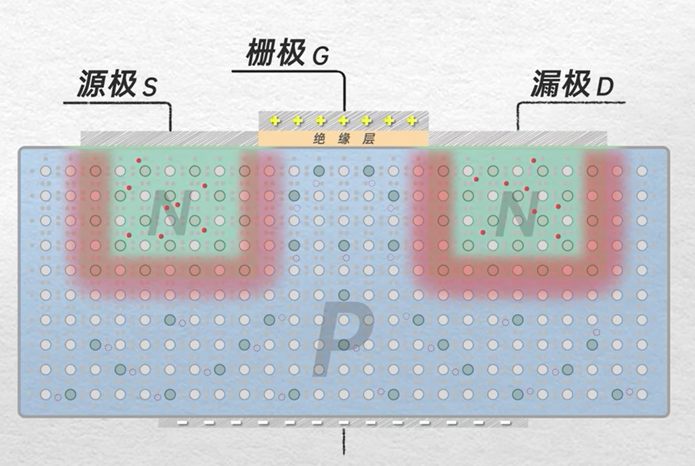<figcaption></figcaption></figure>


Treat the `----` as ground in the image above. But by right, if you treat it as negative also can.


PMOS is just the opposite of NMOS, where the source-body-drain change to "pnp" and the gate is connected to **ground** or **negative voltage** while the body and source and body are connected to **positive voltage**, just as shown as follows,

<figure>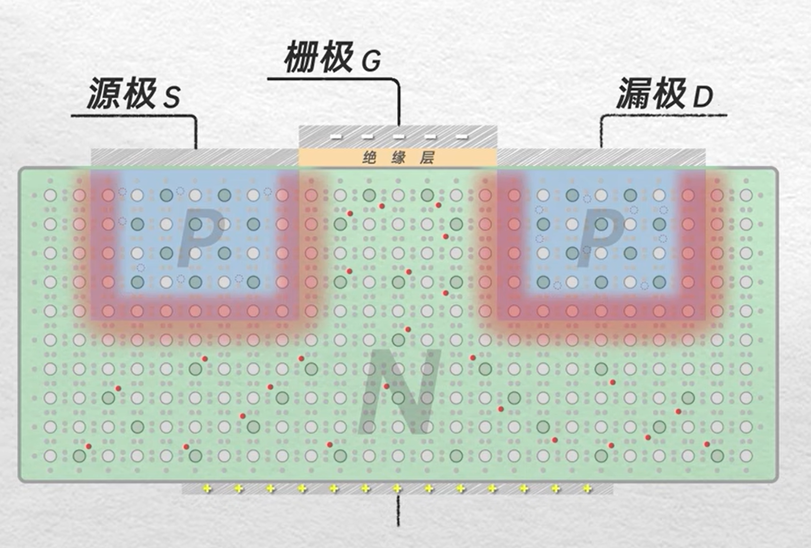<figcaption></figcaption></figure>

As we mentioned earily, the [**rule of thumb**](https://wenbo-notes.gitbook.io/cg2027-notes/lec/lec-01-the-devices#notes) to determine the state of PMOS and NMOS is to see the relationship between |VGS| and |VTH| to determine the ON and OFF of the PMOS. And the relationship between VGS - VDS = VGD and VTH is to determine the saturation region of the PMOS.

When the _p-_&#x63;hannel is formed, since the electric field is from **source to drain**, the electrons will move from **drain to source**, causing the holes to move from **source to drain** through the _p-_&#x63;hannel. Thus the current flows from **source to drain**. So, we can again think of the source as providing **holes** and the drain is consuming **holes**. And eveything will work similarly.

[^1]: "holes" refers to electron holes, which are quasiparticles representing the absence of an electron in a material like a semiconductor. These holes act as **positive charge** carriers and are crucial for modern electronics, such as diodes and transistors.

[^2]: the element where there is a **proton** (<mark style="color:red;">red spheres</mark> shown in the image below) but without an electron. Thus, a hole carries **positive** charge.
