# Lec 02 - CMOS Inverter

## Inverter

An inverter can be thought of as a NOT gate. It will negate whatever value from its input.

### Ideal Inverter

An ideal inverter has the following Vin-Vout graph (also known as Voltage Transfer Characteristic, or VTC)

<figure>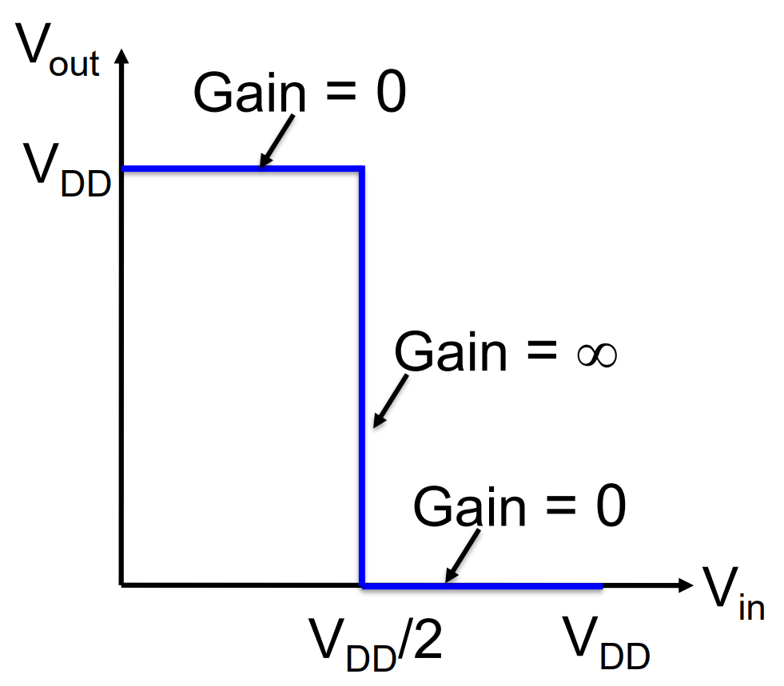<figcaption></figcaption></figure>

From this graph, we can see that

1. When 0 <i class="fa-less-than-equal">:less-than-equal:</i> Vin <i class="fa-less-than-equal">:less-than-equal:</i> VDD /2, Vout = VDD, this means \[0, VDD/2] is Vin's **input low** range. Similarly, \[VDD/2, VDD] is Vin's **input high** range.
   1. [NMH](#user-content-fn-1)[^1]: VDD /2
   2. [NML](#user-content-fn-2)[^2]: VDD /2
   3. [Switch threshold](#user-content-fn-3)[^3]: VDD /2
2. The meaning of **gain** is just the change rate of Vout with respect to Vin, which is $$d\frac{V_{out}}{V_{in}}$$

### Real Inverter

In the real world, the inverter cannot be that perfect. Its Vin-Vout graph is usually shown as follows

<figure><figcaption></figcaption></figure>

From this graph, we will see some very important conventions used in Electrical Engineering

1. In the Vin-Vout graph, we always treat x-axis as Vin and y-axis as Vout.
2. VOH: This is the **nominal (expected) output voltage** when the inverte**r output is logic HIGH**. This is usually around VDD.
3. VOL: This is the **nominal (expected) output voltage** when the inverter **output is logic LOW**. This is around 0V.
   1. VOH and VOL are **nominal values**, and they are **different from** the actual output, which we usually define to be just Vout.
   2. Usually, VOH, VOL, together with VIL and VIH **are specified by the manufacturer** in the **logic family’s datasheet.**
4. VM: This is the **switching threshold**, where Vin = Vout.

#### Mapping between Analog and Digital Signals

As analog signals are **continuous** while digital signals are **discrete**, when we convert analog signals to digital signals, we need to define some "mappings". In this lecture, the following mapping is defined,

<figure>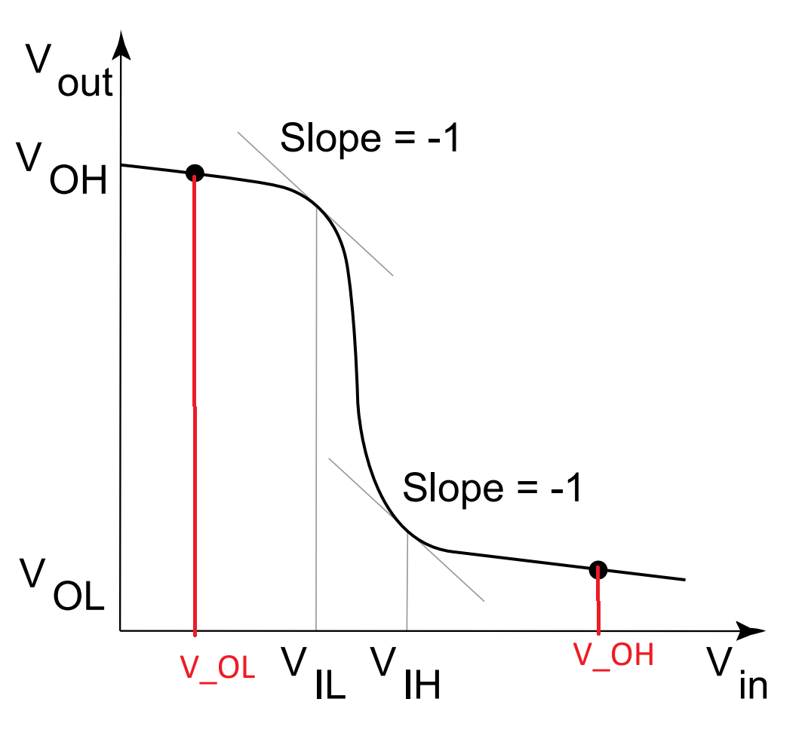<figcaption></figcaption></figure>

From this graph, we add on to the important conventions that will be used in Electrical Engineering

1. VIL: The **highest input voltage** that the gate will still recognize as a logic LOW.
   1. Thus, in this graph, the **input low** range is \[VOL, VIL]
2. VIH: The **lowest input voltage** that the gate will recognize as a logic HIGH.
   1. Thus, in this graph, the **input high** range is \[VIH, VOH]

By definition, VIH and VIL are the operational points of the inverter where $$\frac{dV_{\text{out}}}{dV_{\text{in}}}=-1$$.

#### Noise Margin

**Noise margin** is how much noise a signal can tolerate and still be **read** correctly as 0 or 1. So, in our notation, we can easily treat NMH as the length of **input high** range and NML as the length of the **input low** range.

* NMH = VOH - VIH, or more precisely, VDD - VIH.
* NML = VIL - VOL, or more precisely, just VIL.

<figure>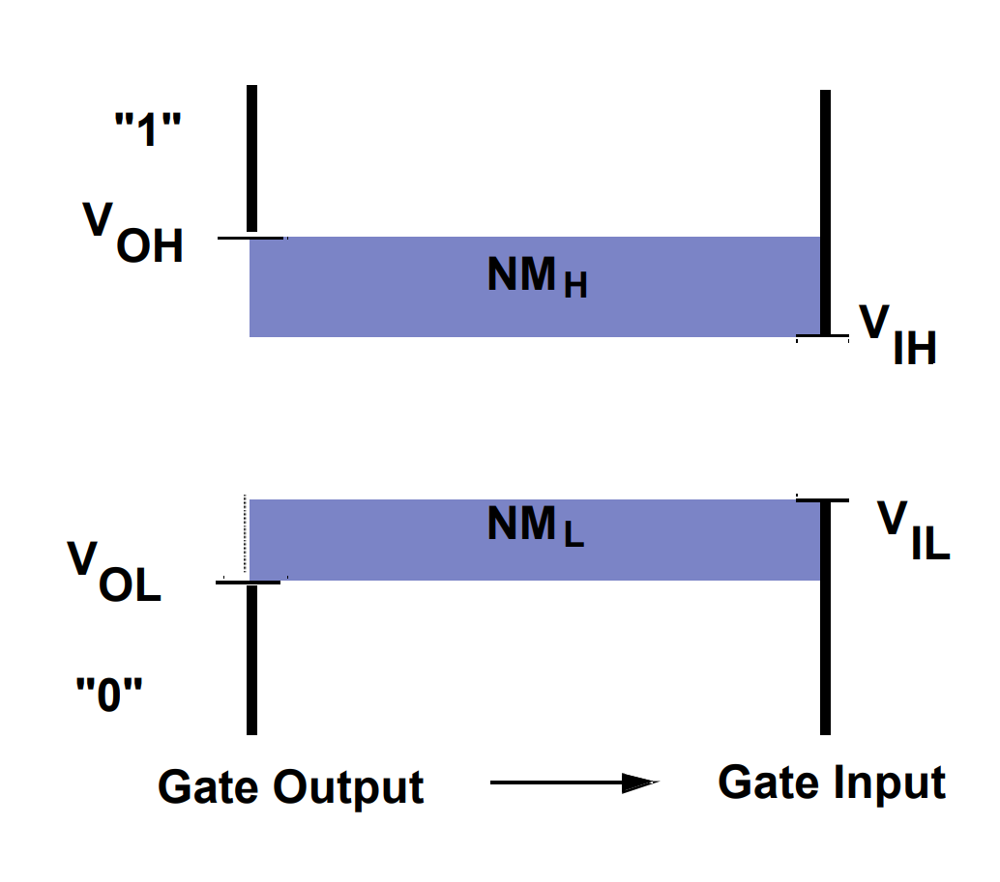<figcaption></figcaption></figure>

Prof. Annie also introduces the following analogy for NMH and NML:

* NMH defines how much the Vout can **drop** from the **nominal high voltage** (VOH) for it to be **read** correctly as logic HIGH by the following gate.&#x20;
* NML defines how much the Vout can **go up** from the **nominal low voltage** (VOL) for it to be **read** correctly as logic LOW by the following gate.&#x20;

#### Fan-in and Fan-out

<figure>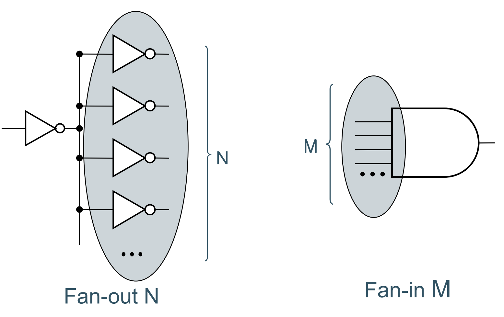<figcaption></figcaption></figure>

From the above image, we can clearly see that

1. **Fan-out** means how many **inputs** are driven by one output the number of gates that one output signal can **drive**.
2. **Fan-in** means how many **inputs** a gate has, it describes the number of signals feeding **into** one logic gate.

## CMOS Inverter

An inverter can be built using one PMOS and one NMOS shown as follows,

<figure>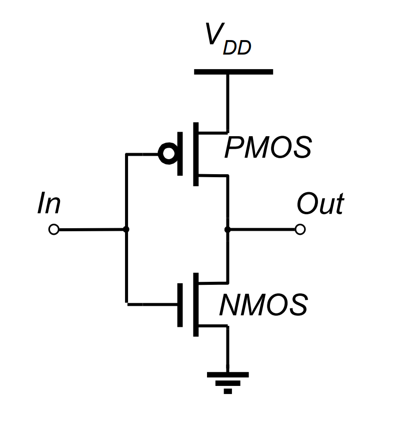<figcaption></figcaption></figure>

### Basic Operation

The basic operations of a CMOS inverter are the same as the inverter. Basically, it's just when input = 0, output = 1 and when input = 1, output = 0. But in this part, we will use the |VGS| thinking to decide the ON/OFF state of the PMOS and NMOS.

<figure>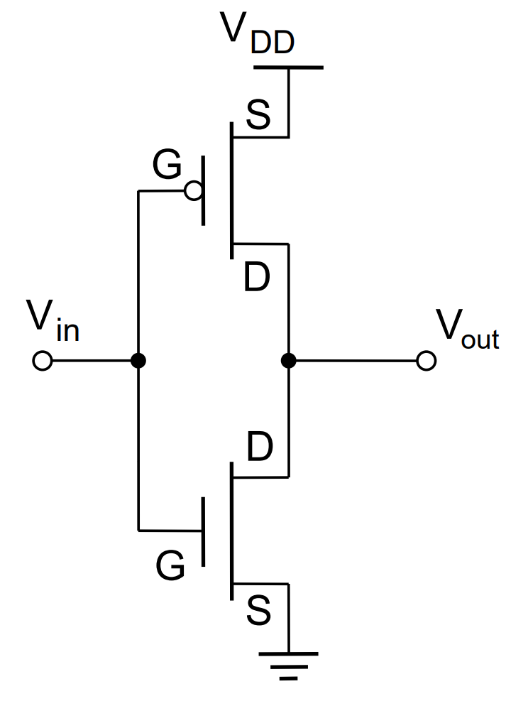<figcaption></figcaption></figure>

1. **Input = 0 -> Output = 1**: NMOS's |VGS| = 0 < |VTH|, NMOS is OFF. PMOS's |VGS| = VDD > |VTH|, PMOS  is ON. Thus, Vout is connected to VDD, output is 1.
2. **Input = 1 -> Output = 0**: NMOS's |VGS| = VDD > |VTH|, NMOS is ON. PMOS's |VGS| = 0 < |VTH|, PMOS  is OFF. Thus, Vout is connected to ground, output is 0.

Are VTH for NMOS and PMOS the same?

As you may notice, we are comparing the |VGS| with the **same** |VTH| in above. This is **not a typo!** In real world, we do **try to** make VTH of PMOS and NMOS the same. This is done by using the [**sizing technique**](https://wenbo-notes.gitbook.io/cg2027-notes/tut/tutorial-1#id-02.-on-resistance) we have introduced in Tutorial 1 to change the on resistance of the PMOS and NMOS.

### Switching Characteristics

As Vin changes, the CMOS inverter goes through **five** different combinations of **regions of operation**. These combinations are indicated below:

1. 0 <i class="fa-less-than-equal">:less-than-equal:</i> Vin <i class="fa-less-than-equal">:less-than-equal:</i> VTN: NMOS off, PMOS on.
2. VTN < Vin < Vinv: PMOS linear, NMOS saturation.
3. Vin = Vinv: Both PMOS and NMOS saturation
4. Vinv < Vin < VDD - |VTP|: NMOS linear, PMOS saturation
5. VDD - |VTP| < Vin <i class="fa-less-than-equal">:less-than-equal:</i> VDD: PMOS OFF, NMOS ON

where,

* Vinv is the **switching voltage** (same as the VM we have introduced [above](lec-02-cmos-inverter.md#real-inverter))
* VTN is the **threshold voltage** of an NMOS.
* VTP is the **threshold voltage** of an PMOS.

To understand it more clearly, let's use the following example,

<figure>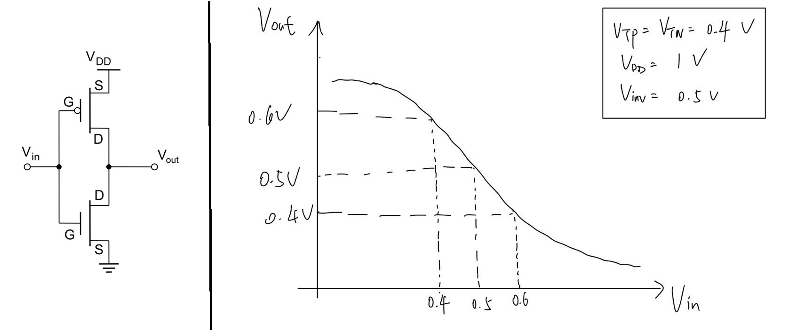<figcaption></figcaption></figure>

Suppose VTN = 0.3V, VTP = -0.3V, VDD = 1V and Vinv = 0.5V

1. 0 <i class="fa-less-than-equal">:less-than-equal:</i> Vin <i class="fa-less-than-equal">:less-than-equal:</i> VTN -> 0 <i class="fa-less-than-equal">:less-than-equal:</i> Vin <i class="fa-less-than-equal">:less-than-equal:</i> 0.3: Let's take Vin = 0.2V and assume Vout = 1V.
   1. NMOS: |VGS| < |VTN|, NMOS is OFF.
   2. PMOS: |VGS| <i class="fa-greater-than-equal">:greater-than-equal:</i> 0.7V > |VTP|, PMOS is ON. VGD = -0.8V < VTP, PMOS in **linear region**.
2. VTN < Vin < Vinv -> 0.4 < Vin < 0.5: Let's take Vin = 0.45V and assume Vout drops a bit but is still high, is 0.9V.
   1. NMOS: |VGS| > |VTN|, NMOS is ON. VGD = -0.45V < VTN, NMOS operates in **saturation** **region**.
   2. PMOS: |VGS| > |VTP|, PMOS is ON. VGD = -0.45V < VTP, PMOS operates in **linear** **region.**
3. Vin = Vinv: Let's say Vin = 0.5V and Vout = 0.5V
   1. NMOS: |VGS| > |VTN|, NMOS is still on. VGD = 0 < VTN, NMOS operates in **saturation region**.
   2. PMOS: |VGS| > |VTP|, PMOS is still on. VGD = 0 > VTP, PMOS operates in **saturation region**.
4. Vinv < Vin < VDD - |VTP| -> 0.5 < Vin < 0.6V. Let's take Vin = 0.55V and assume Vout is 0.2V.
   1. NMOS: |VGS| > |VTN|, NMOS is ON. VGD = 0.35V > VTN, NMOS operates in **linear region**.
   2. PMOS: |VGS| > |VTP|, PMOS is ON. VGD = 0.35V > VTP, PMOS operates in **saturation region**.
5. VDD - |VTP| < Vin < VDD -> 0.6 < Vin < 1. Let's take Vin = 0.75V and assum Vout is 0V.
   1. NMOS: |VGS| > |VTN|, NMOS is ON. VGD = 0.75V > VTN, NMOS operates in **linear region**.
   2. PMOS: |VGS| < |VTP|, PMOS is OFF.


Vin is the gate voltage VG here.


The above calculation is based on the following table we have introduced in Lec 01. As for the CMOS inverter case,

* For NMOS: Vgsn = Vin, Vdsn = Vout.
* For PMOS: Vgsp = Vin - VDD, Vdsn = Vin - VDD.

<figure><figcaption></figcaption></figure>

To summarize the five regions of operations together into one image, we have the following VTC of CMOS inverter

<figure>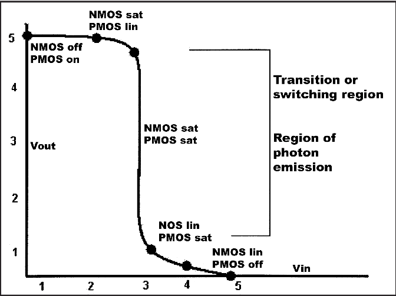<figcaption></figcaption></figure>

Now, we can draw the [short-circuit current](#user-content-fn-4)[^4] (Iinv) vs. Vin graph, and it looks like as follows,

<figure>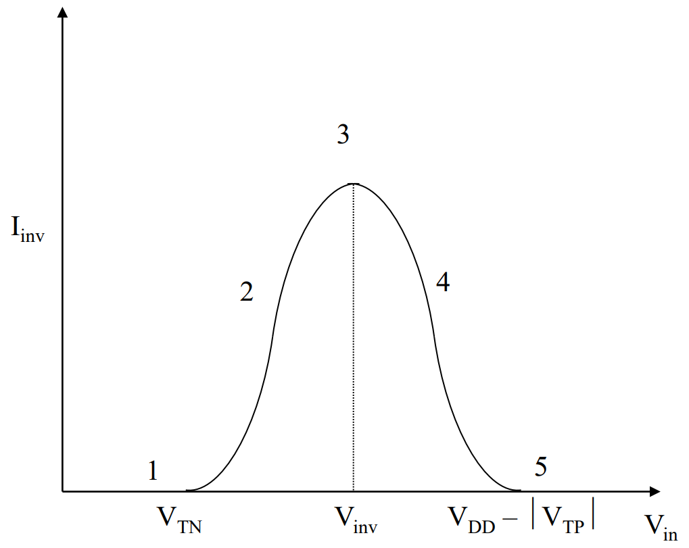<figcaption></figcaption></figure>

From the graph above, we can see that the CMOS **seems to** only consume power when **switching**.

However, as I use "seems to" above, means that in reality, due to [**sub-threshold currents**](#user-content-fn-5)[^5], etc, there is still some power consumption when the CMOS inverter is in OFF state.

### Inverter with a Load

Normally, CMOS inverter will have parastic resistances and capacitances attached to the **output node**. Hence principle of operation of inverter alters a bit. This reflects in the appearnce of rise time (tr), fall time (tf), ..., we have introduced in [Lec 01](https://wenbo-notes.gitbook.io/cg2027-notes/tut/tutorial-1#id-01.-delay-calculation).

<figure>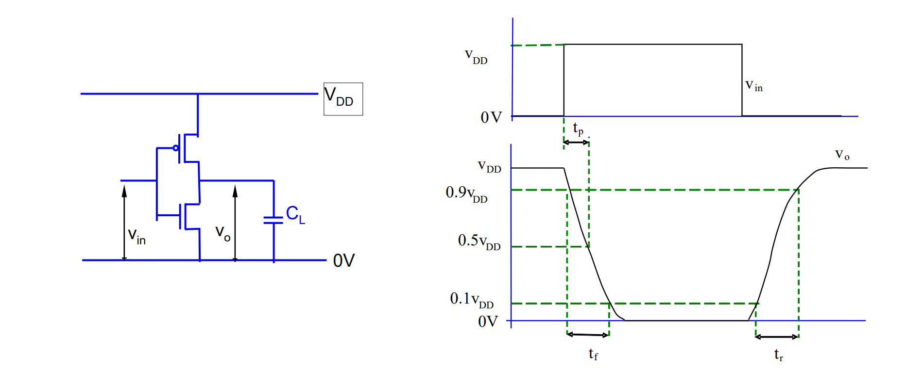<figcaption></figcaption></figure>

These time delays appear because **charging** and **discharging** the capacitor attached to the output node takes time! (CG1111A again!)



#### Charging the load

<figure>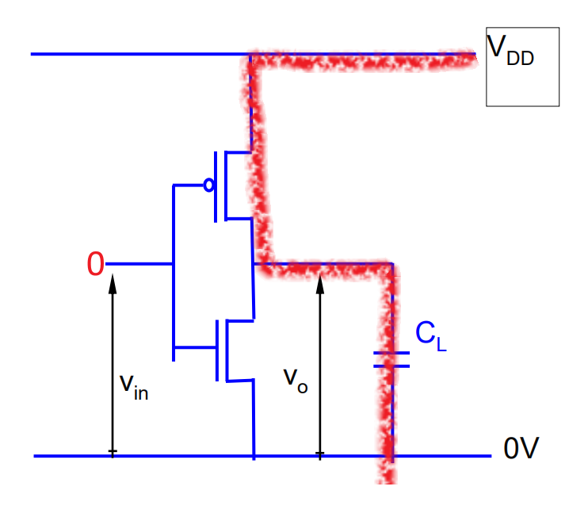<figcaption></figcaption></figure>

When Vin = 0V, the PMOS will turn on the current will flow from VDD, through the PMOS device (it has on resistance!) and finally through the capacitor to charge it until the capacitor is fully charged.


That's why PMOS device is called **pull-up device**.





#### Discharging the load

<figure>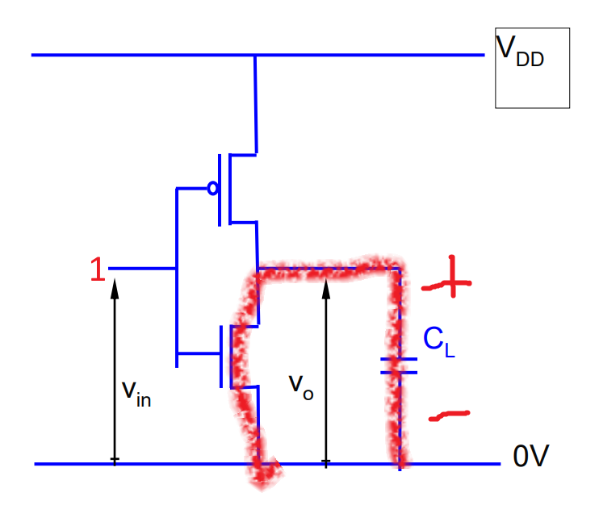<figcaption></figcaption></figure>

After the capacitor is fully charged, it has the polarity shown as above. Now, if Vin = 1, our PMOS will be turned off and NMOS will be turned ON, forming a circuit so that the current can flow from the capacitor, through the NMOS device, and lastly to the ground until the capacitor is finally discharged.


That's why NMOS device is called **pull-down device**.





#### Transient Response

As it takes time to charge and discharge the capacitor, we can do the transient analysis to get a formula for calculating tpLH (when charging) and tpHL (when discharging).

<figure>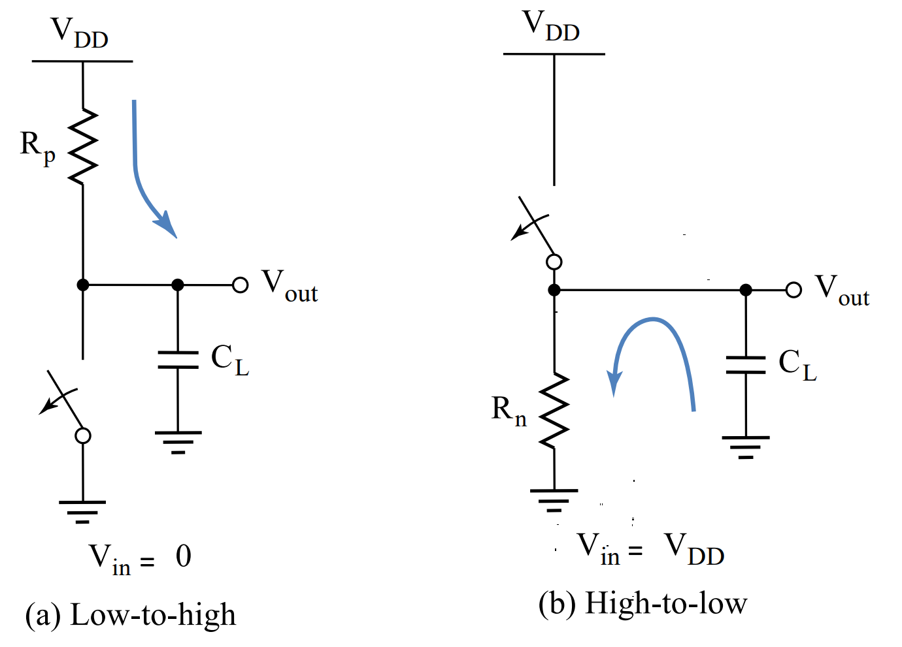<figcaption></figcaption></figure>

For an RC circuit, the capacitor voltage at time $$t$$ is given by

$$
V(t)=V_{\text{DD}}\cdot e^{-t/RC}
$$

Recall that when we are doing the tpLH and tpHL calculation, we are only interested in the 50% point. So

* When charging, tpLH is the time taken for Voltage across the capacitor to go from 0 -> VDD/2.
* When discharging, tpHL is the time taken for Voltage across the capacitor to go from VDD/2 -> 0.

Thus, we can plug V(t) = VDD/2 into our formula and solve for $$t$$

$$
\begin{align*}\frac{V_{\text{DD}}}{2}&=V_{\text{DD}}\cdot e^{-t/RC}\\
t&=\ln2\cdot R\cdot C\\t&\approx0.69\cdot R\cdot C\end{align*}
$$

where $$R$$ is the **on resistance** of the PMOS/NMOS device, and $$C$$ is the capacitance of the capacitor.


Hence, a **fast gate** is built either by keeping the output capacitance **small** or by decreasing the on-resistance of the transistor.


There is also a second approach to know the propagation delay if we don't know the **on-resistance**, it is introduced [later](lec-02-cmos-inverter.md#cmos-inverter-propagation-delay).

## Power Dissipation

As we have seen above, when the CMOS is switching, the **short circuit current** will consume some power. Also, we have mentioned about the **leakage current**, which will also consume some power. Lastly, as we have introduced the capacitors above, charging and discharging the capacitors will also consume some power, this is called [**dynamic power consumption**](lec-02-cmos-inverter.md#dynamic-power-consumption).

### Dynamic Power Consumption

We have already seen the image when we are charging the capacitor,

<figure>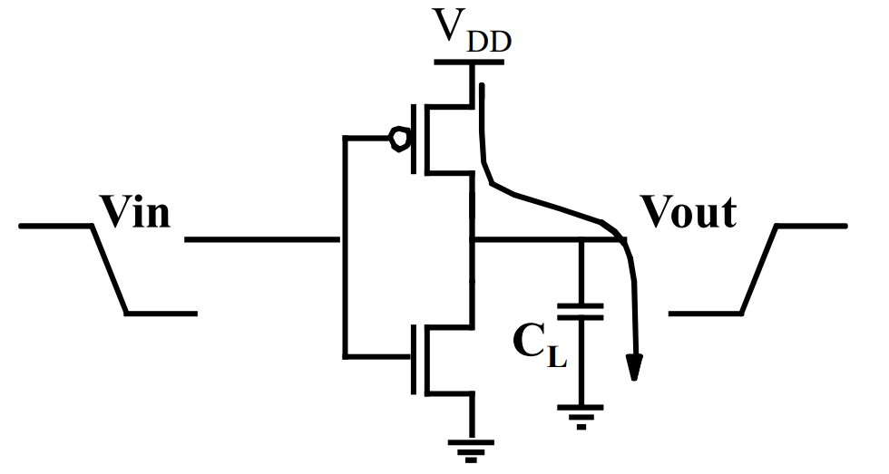<figcaption></figcaption></figure>

The **total** energy/transition is $$C_L\cdot V_{\text{DD}}^2$$, and it can be calculated by integrating the following

$$
E_{\text{VDD}}=\int_0^\infty i_{\text{VDD}}(t)\cdot V_{\text{DD}}~dt
$$

Since $$V_{\text{DD}}$$ is constant, move it outside the integral:

$$
\begin{align*}
E_{\text{VDD}} &= V_{\text{DD}} \int_0^\infty i_{\text{VDD}}(t)~dt
\end{align*}
$$

For a capacitive load $$C_L$$, use $$i_{\text{VDD}}(t) = C_L \frac{dv_{\text{out}}(t)}{dt}$$ (during charging, where $$v_{\text{out}}$$ is the output voltage):

$$
\begin{align*}
E_{\text{VDD}} &= V_{\text{DD}} \int_0^\infty C_L \frac{dv_{\text{out}}(t)}{dt}~dt
\end{align*}
$$

Move $$C_L$$ outside and change variable to $$v = v_{\text{out}}$$ (substitute $$dt = dv / (dv/dt)$$):

$$
\begin{align*}
E_{\text{VDD}} &= V_{\text{DD}}\cdot C_L \int_0^{V_{\text{DD}}}1~dv
\end{align*}
$$

Evaluate the integral (limits from 0 to $$V_{\text{DD}}$$ as $$v_{\text{out}}$$ charges fully):

$$
\begin{align*}
E_{\text{VDD}} &= V_{\text{DD}} \cdot C_L \cdot V_{\text{DD}} = C_L V_{\text{DD}}^2
\end{align*}
$$

Its power is energy/transition times frequency f, which is $$C_L\cdot V_{\text{DD}}^2\cdot f$$. However, we can see the in this circuit, the capacitor will also take some power consumption, and it can be calculated by integrating the follwoing, which will give us $$\frac{1}{2}\cdot C_L\cdot V_{\text{DD}}^2$$,

$$
E_{C_L}=\int_0^\infty i_{\text{VDD}}(t)\cdot v_{\text{out}}~dt
$$

Similarly as above, for a capacitive load $$C_L$$, use $$i_{\text{VDD}}(t) = C_L \frac{dv_{\text{out}}(t)}{dt}$$ (during charging, where $$v_{\text{out}}$$ is the output voltage):

$$
\begin{align*}
E_{C_L} &= \int_0^\infty C_L \frac{dv_{\text{out}}(t)}{dt} \cdot v_{\text{out}}(t)~dt
\end{align*}
$$

Move $$C_L$$ outside the integral:

$$
\begin{align*}
E_{C_L} &= C_L \int_0^\infty v_{\text{out}}(t) \cdot \frac{dv_{\text{out}}(t)}{dt}~dt
\end{align*}
$$

Substitute $$v = v_{\text{out}}$$, so $$dv = \frac{dv_{\text{out}}}{dt}dt$$, and change the limits of integration from $$t: 0 \to \infty$$ to $$v: 0 \to V_{\text{DD}}$$ (as $$v_{\text{out}}$$ charges from 0 to $$V_{\text{DD}}$$):

$$
\begin{align*}
E_{C_L} &= C_L \int_0^{V_{\text{DD}}} v~dv
\end{align*}
$$

Evaluate the integral:

$$
\begin{align*}
\int_0^{V_{\text{DD}}} v~dv &= \left[ \frac{1}{2} v^2 \right]_0^{V{\text{DD}}} = \frac{1}{2} V_{\text{DD}}^2 - 0 = \frac{1}{2} V_{\text{DD}}^2.
\end{align*}
$$

Thus, the final result is:

$$
\begin{align*}
E_{C_L} &= C_L \cdot \frac{1}{2} V_{\text{DD}}^2 = \frac{1}{2} C_L V_{\text{DD}}^2
\end{align*}
$$

But this is only **half** of the total energy consumption. Where does the rest **half** go? If you think about it, it won't be hard to find out that the other half is dissipated as **heat** on the PMOS's resistor.


The above analysis is based on the PMOS! In other words, when we are **charging**! When we are **discharging**, the **energy consumption from the power supply** is **0J**! And all the energy stored in the capacitor ($$\frac{1}{2}\cdot C_L\cdot V_{\text{DD}}^2$$) will dissipate as heat on the NMOS's resistor.


#### Modification for Circuits with Reduced Swing

As we have seen above, we can exploit **reduced swing** to lower the power. And the circuit after modification is shown below,

<figure>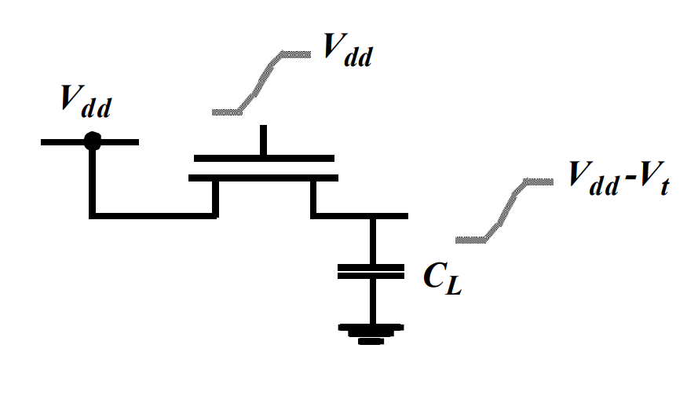<figcaption></figcaption></figure>

And now the energy per transition will be $$E_{0 \to 1} = C_L \cdot V_{\text{dd}} \cdot (V_{\text{dd}} - V_t)$$ and the energy for the capacitor will be $$\frac{1}{2}\cdot C_L\cdot (V_{\text{DD}}-V_t)^2$$.


We can just change the upper limit from $$V_{\text{DD}}$$ to $$V_{\text{DD}}-V_t$$ to get the above result. The integration processes are exactly the same.


#### Node Transition Activity and Power

Now, let's consider switching a CMOS gate for $$N$$ clock cycles

$$
E_N = C_L \cdot V_{\text{dd}}^2 \cdot n(N)
$$

where $$E_N$$ is the energy consumed for $$N$$ clock cycles and $$n(N)$$ is the number of $$0\to1$$ transitions in $$N$$ clock cycles. Thus, we can have the average power $$P_{\text{avg}}$$ as follows,

$$
\begin{align*}
P_{\text{avg}} &= \lim_{N \to \infty} \frac{E_N}{N} \cdot f_{\text{clk}} = \left( \lim_{N \to \infty} \frac{n(N)}{N} \right) \cdot C_L \cdot V_{\text{dd}}^2 \cdot f_{\text{clk}}
\end{align*}
$$

We can further define the **activity factor** $$\alpha_{0\to1}$$ as follows,

$$
\begin{align*}
\alpha_{0 \to 1} &= \lim_{N \to \infty} \frac{n(N)}{N}
\end{align*}
$$

And now, we can rewrite our average power $$P_{\text{avg}}$$ as follows,

$$
\begin{align*}
P_{\text{avg}} &= \alpha_{0 \to 1} \cdot C_L \cdot V_{\text{dd}}^2 \cdot f_{\text{clk}}
\end{align*}
$$

#### CMOS Inverter Propagation Delay

In the [#transient-response](lec-02-cmos-inverter.md#transient-response "mention") analysis, we have already seen how to calculate the propagation delay of a CMOS inverter when we know the NMOS/PMOS **on-resistance** as well as the capacitance $$C_L$$. Now, we introduce the second method to know the propagation delay if we don't know the **on-resistance**, but know the **average current** Iav in the circuit.

Starting with $$i = C \frac{dv}{dt}$$, move $$dt$$ to the L.H.S and integrate both sides:

$$
\begin{align*}
i ~ dt &= C ~ dv
\end{align*}
$$

Integrate from initial to final conditions, where $$v$$ goes from $$v_1$$ to $$v_2$$ and time $$t_p$$ is the propagation delay:

$$
\begin{align*}
\int_0^{t_p} i(t)~dt &= \int_{v_1}^{v_2} C~dv
\end{align*}
$$

Since $$C = C_L$$ is constant, factor it out:

$$
\begin{align*}
C_L \int_0^{t_p} i(t)~dt &= C_L \int_{v_1}^{v_2}1~dv
\end{align*}
$$

The right-hand side integrates to the voltage difference:

$$
\begin{align*}
C_L \int_0^{t_p} i(t)~dt &= C_L (v_2 - v_1)
\end{align*}
$$

The left-hand side represents the charge transferred, and since $$I_{\text{av}} = \frac{1}{t_p} \int_0^{t_p} i(t)~dt$$, substitute $$I_{\text{av}} \cdot t_p$$:

$$
\begin{align*}
I_{\text{av}} \cdot t_p &= C_L (v_2 - v_1)
\end{align*}
$$

Solve for $$t_p$$:

$$
\begin{align*}
t_p &= \frac{C_L (v_2 - v_1)}{I_{\text{av}}}
\end{align*}
$$

For the high-to-low propagation delay $$t_{\text{PHL}}$$, $$v_2 - v_1 = V_{\text{swing}}$$ (full swing from $$V_{\text{DD}}$$ to 0, but noting $$t_p$$ is 50% of full swing), so we have:

$$
t_{\text{PHL}} = \frac{C_L V_{\text{swing}}/2}{I_{\text{av}}}
$$

## Load Capacitance / Resistance

### Load Capacitance

When a CMOS gate **drives** another CMOS gate, the driver "sees" a [**capacitive load**](#user-content-fn-6)[^6]. The load capacitance consists of

1. **gate capacitance** of the load from two MOSFETS on the right (Cg)
2. **junction capacitance** from common **drain** of the driver inverter on the left (Cj), and
3. the **parastic routing capacitance** from the metal line used for connection (Cw)

<figure>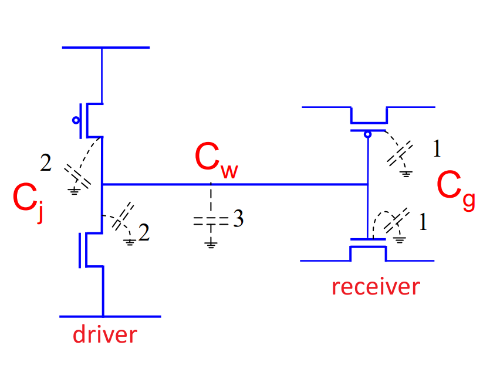<figcaption></figcaption></figure>

In other words, the **load capacitcance** is

$$
C_L=C_g+C_j+C_w
$$

#### Transistor



#### Gate Capacitance

Gate capacitances estimation in different regions is below. However many times **a constant value** is used.

<figure>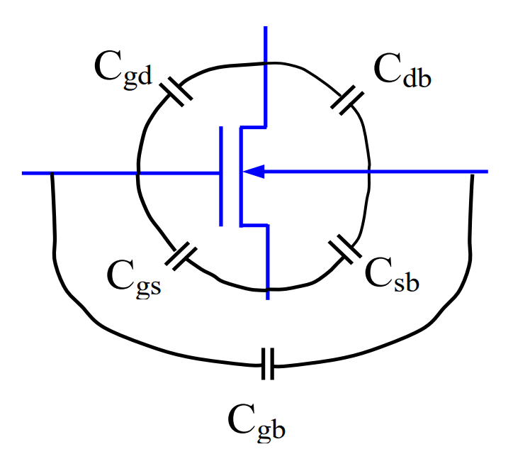<figcaption></figcaption></figure>

| Parameter  | Off                                   | Linear                                 | Saturation                              |
| ---------- | ------------------------------------- | -------------------------------------- | --------------------------------------- |
| $$C_{gb}$$ | $$\frac{\epsilon_{sio_2} A}{t_{ox}}$$ | 0                                      | 0                                       |
| $$C_{gs}$$ | 0                                     | $$\frac{\epsilon_{sio_2} A}{2t_{ox}}$$ | $$\frac{2\epsilon_{sio_2} A}{3t_{ox}}$$ |
| $$C_{gd}$$ | 0                                     | $$\frac{\epsilon_{sio_2} A}{2t_{ox}}$$ | 0                                       |

In this table, $$\epsilon_{sio_2}=\epsilon_o\cdot\epsilon_v$$, and $$A$$ is the area, which is the same as $$W\cdot L$$.



#### Wire Capacitance

$$
C_{\text{wire}}=C_{pp}+C_{\text{fringe}}
$$

$$C_{pp}$$ is the same as $$C_{\text{area}}$$, which can be calculated using

$$
C_{\text{area}}=C_{\text{per unit area}}\cdot W\cdot L \tag{1}
$$

where, $$C_{\text{per unit area}}=\frac{\epsilon}{t}$$, and $$\epsilon$$ is the **electron mobility** and $$t$$ is the thickness. However, the $$C_{\text{per unit area}}$$ will usually be given.


The Eq. (1) applies to **any capacitance** calculation.




### Load Resistance

To calculate the resistance, we can use the following formula

$$
R=\frac{\rho\cdot L}{H\cdot W}
$$

where we treat $$\frac{\rho}{H}$$ as a whole and name it as **sheet resistance** with the unit ( $$\Omega/\square$$) and $$\frac{L}{W}$$ has the unit of $$\square$$ and they **must** be converted to the same unit before the division!

[^1]: For Vout to be **high**, the acceptable range of Vin

[^2]: For Vout to be **low**, the acceptable range of Vin

[^3]: The value of Vin that causes Vout to change from low to high or high to low.

[^4]: the current that flows directly from VDD to Ground

[^5]: one of the main sources of **leakage current**, which is a tiny amount of current that leaks through the device when it is idle.

[^6]: This is the $$C_L$$ we used in all our previous sections.
