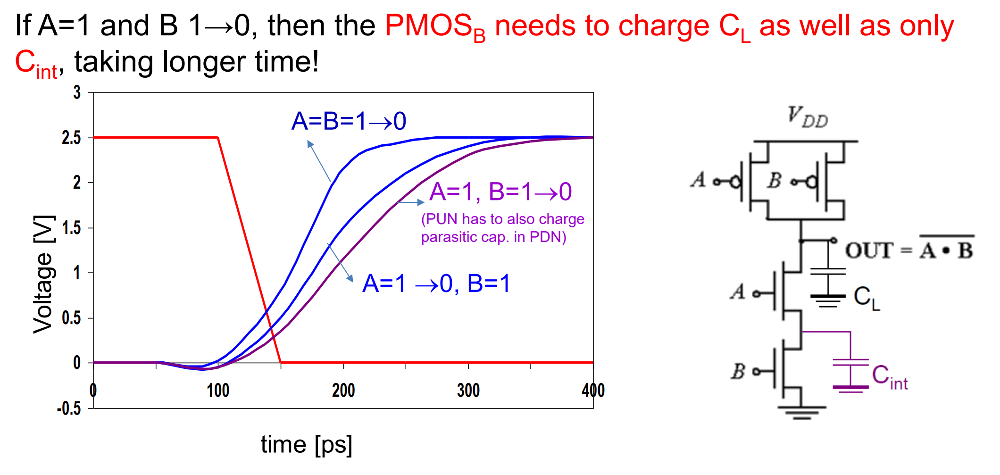
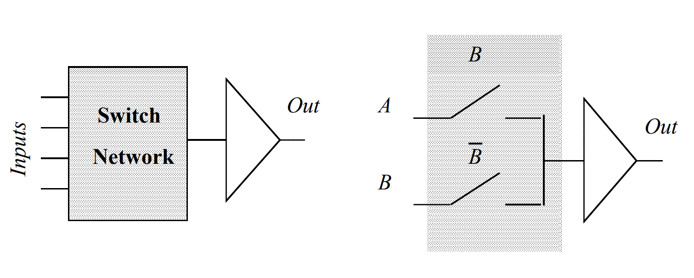
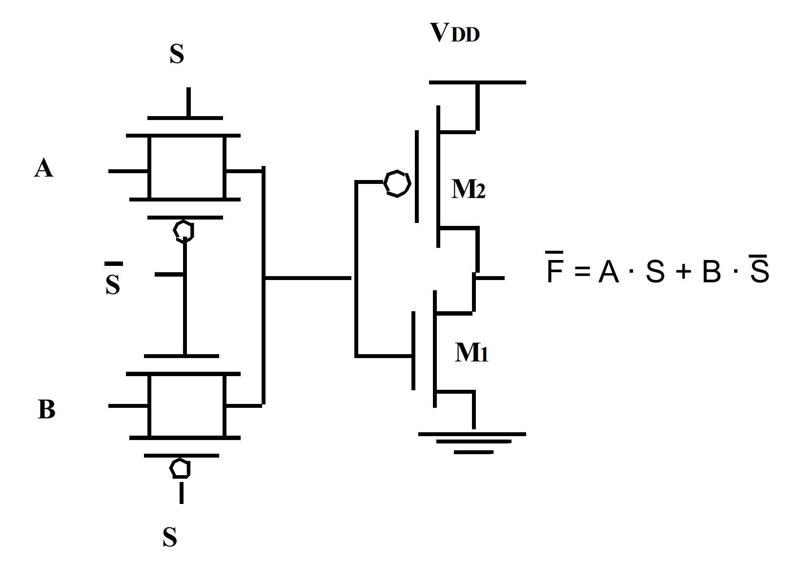
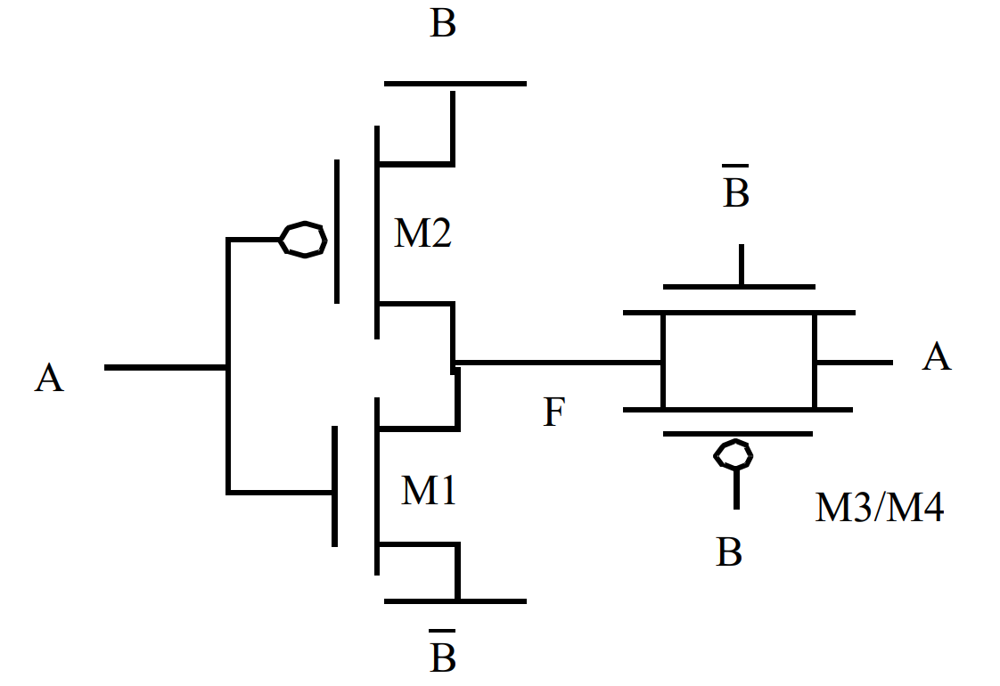
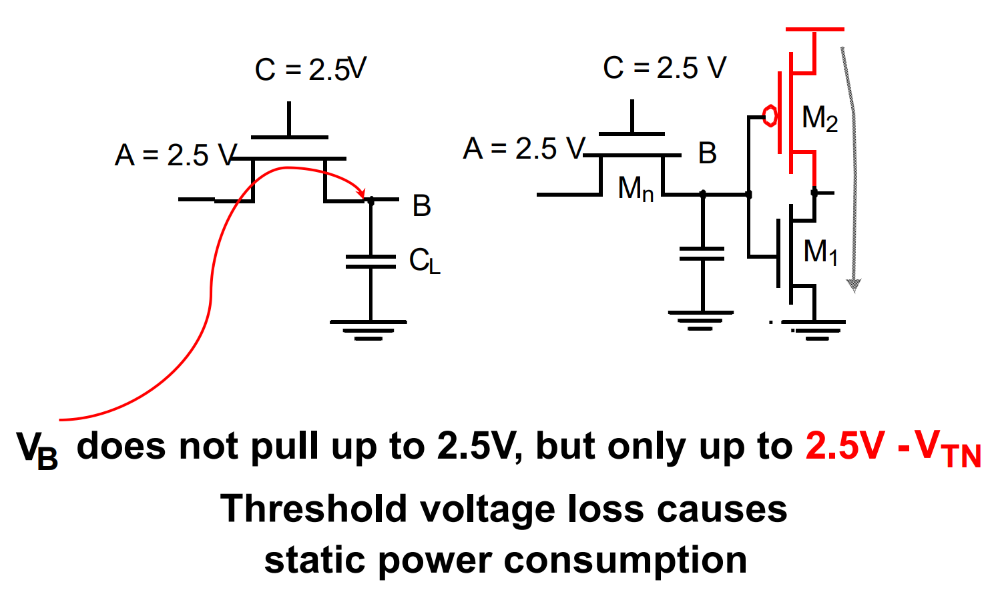
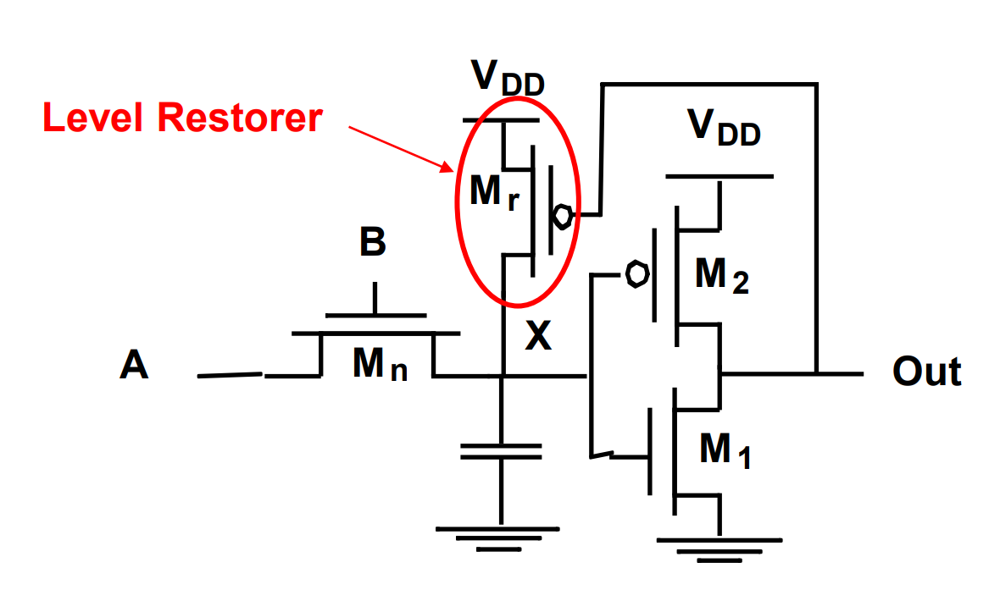
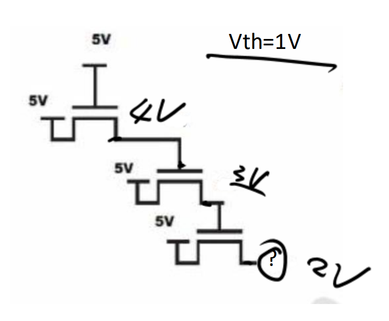
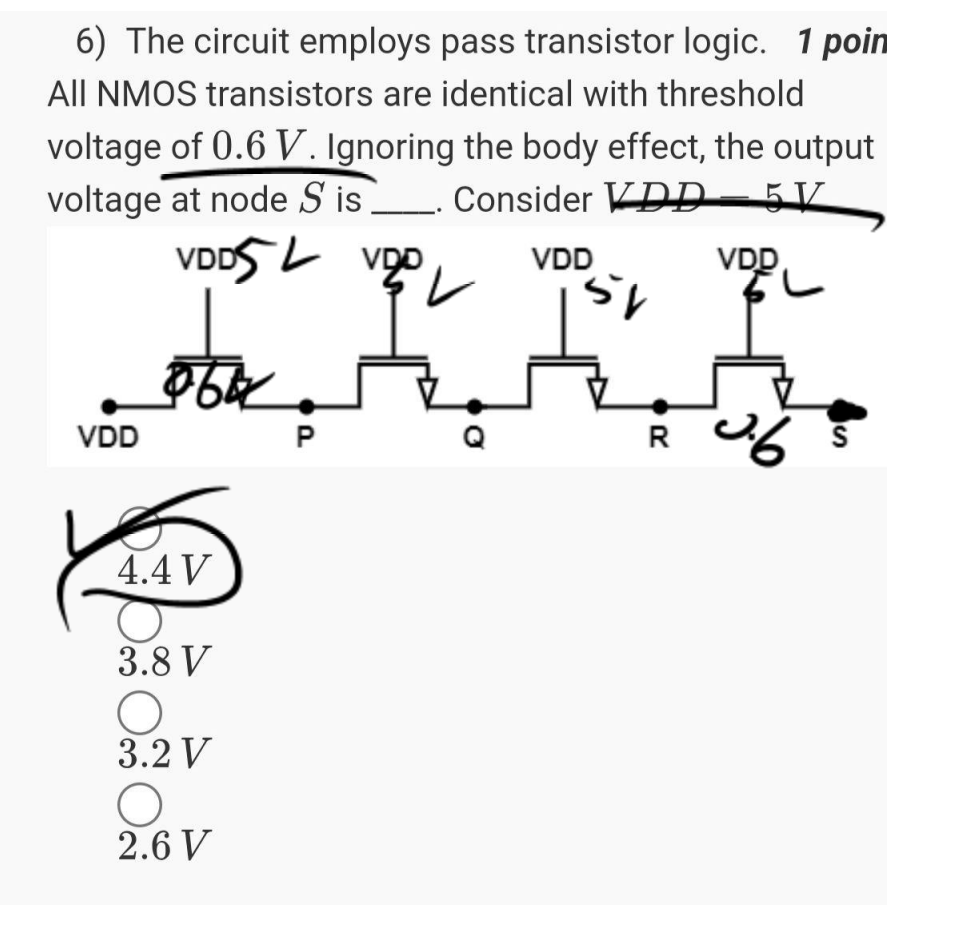

# Lec 03 - CMOS Logic

## The Switch Model

To understand CMOS logic, we first treat transistors as ideal switches with specific characteristics regarding how well they pass logic levels (Voltage).

| **Switch Behavior** | Closed (ON) when Gate = **HIGH**           | Closed (ON) when Gate = **LOW**        |
| ------------------- | ------------------------------------------ | -------------------------------------- |
| **Connection**      | Typically in **PDN** (Pull-Down Network)   | Typically in **PUN** (Pull-Up Network) |
| **Signal Strength** | Passes **Strong 0**                        | Passes **Strong 1**                    |
|                     | Passes **Weak 1**                          | Passes **Weak 0**                      |
| **Voltage Limits**  | Output rises only to ($$V_{DD} - V_{TN}$$) | Output drops only to $$|V_{TP}|$$      |

Because NMOS is bad at passing 1s and PMOS is bad at passing 0s, we use complementary pairs (CMOS). PMOS pulls up to $$V_{DD}$$ (Strong 1), and NMOS pulls down to GND (Strong 0).

## Deriving Boolean Functions

In static CMOS, the function is determined by the connection of transistors. The construction rule is to use PUN/PDN:

* **PDN (Pull-Down Network)**: Connects output to GND.
  * A OR B -> A and B in **parallel**
  * A AND B -> A and B in **series**
* **PUN (Pull-Up Network)**: Dual/The exact complement of the PDN. Connects output to $$V_{DD}$$.

To derive the CMOS logic,&#x20;

* **Look at the PDN**: Write the boolean equation based on the NMOS connections.
  * If A and B are in series: $$A \cdot B$$
  * If A and B are in parallel: $$A + B$$
* **Invert the Overall Expression**: The physical output of a CMOS gate is always inverted (NAND, NOR, NOT).
  * $$Y = \overline{\text{PDN Expression}}$$

## Transistor Sizing & Resistance

We size transistors to achieve **Equal Worst-Case** Resistance for both pull-up and pull-down paths. This ensures the rise time ($$t_{pLH}$$) and fall time ($$t_{pHL}$$) are approximately equal.

### Physics

We start from the mobility ratio. Electrons (NMOS) are faster than holes (PMOS).

* $$\mu_n \approx 2 \mu_p$$
* So, the resistivity ratio is $$\rho_p : \rho_n \approx 2 : 1$$

As the resistance formula is:

$$
R = \frac{\rho L}{A} = \frac{\rho L}{H \times W}
$$

* $$L$$ (Length) and $$H$$ (Height/Thickness) are **fixed** by the technology process.
* We control $$W$$ (Width) to adjust Resistance.


This is also why sizing usually refers to adjusting the **width**.


### Sizing for Symmetry

To achieve $$R_p = R_n$$ (Equal Resistance):

* Since PMOS is 2x more resistive per unit width, we must make it 2x wider.
* Ratio: $$W_p : W_n = 2 : 1$$ and $$\sum W_p:\sum W_n=1:2$$.

### Definitions

Some other definitions that we might encounter

* **INV1X**: A standard unit inverter where $$R_p = R_n$$. We treat the NMOS resistance as "1 unit $$R$$". So, for the resistance
  * Pull-Up ($$R_p$$) = $$R$$ (1 Unit Resistance)
  * Pull-Down ($$R_n$$) = $$R$$ (1 Unit Resistance)
  * During the calculation, the pull-up result and the pull-down result should finally be simplified to $$\frac{\rho}{W}$$ assuming that $$\rho$$ is for NMOS.
* In **INV4x**, the inverter that is 4 times larger (in terms of transistor width) than the standard INV1X. Thus, for the resistance.&#x20;
  * Pull-Up ($$R_p$$) = $$\frac{R}{4}$$ (0.25 Unit Resistance)
  * Pull-Down ($$R_n$$) = $$\frac{R}{4}$$ (0.25 Unit Resistance)
  * For an INV4X inverter, the equivalent worst-case resistance for both the pull-up and pull-down networks simplifies to: $$\frac{\rho}{4W}$$.
* **Area Estimation**: Total Width Sum ($$\sum W$$) is an indicator of the total silicon area required.

## Propagation Delay

**Delay** is the time required for the output to switch states.

* $$t_{pLH}$$ (Low-to-High): Time to charge output to $$V_{DD}$$. Requires **PMOS** to conduct.
* $$t_{pHL}$$ (High-to-Low): Time to discharge output to GND. Requires **NMOS** to conduct.

### Calculation

We model the transistor as a resistor ($$R$$) and the load as a capacitor ($$C$$).

$$
t_p \approx 0.69 \cdot R_{eq} \cdot C_L
$$

#### Input Pattern

Delay depends on _which_ and _how many_ transistors are ON. For example, in the following figure, we can see that

1. A=B=1->0 will charge the fastest
2. Then is A=1->0, B=1 because only CL needs to be charged.
3. A=1, B=1->0 is the slowest because both CL and Cint need to be charged.&#x20;

<figure><figcaption></figcaption></figure>


When analyzing a transition (e.g., Input B goes $$1 \to 0$$). Treat signal B as 0 for the steady-state analysis of that timeframe.


This will give us a tip for circuit optimizing

> Place the transistor controlled by the latest signal **closer to the Output node** (rather than the supply rail). This minimizes the capacitance that the late signal needs to charge/discharge, speeding up the final transition.

## Advanced Circuit Structures

### Pass Transistor Logic

**Pass Transistor** uses transistors as switches to pass data signals (not just $$V_{DD}$$/GND).

<figure><figcaption></figcaption></figure>

For example, we can use pass transistor logic to build a multiplexer as follows:

<figure><figcaption>
Multiplexer using pass transistor logic
</figcaption></figure>


The issue is that passing a "1" through an NMOS results in a voltage drop ($$V_{DD} - V_{TN}$$).


### Transmission Gate

Transmission gate combines NMOS and PMOS together and it can pass both strong 0s and strong 1s. Thus, XOR gate and multiplexer can be built using transmission gate.

<figure><figcaption>
XOR gate using transmission gate
</figcaption></figure>

### Level Restoration Circuit

When using Pass Transistors (specifically NMOS-only), the "Weak 1" can be problematic.

<figure><figcaption></figcaption></figure>

To solve it, we can use a "Level Restorer" (a weak PMOS feedback loop) to pull the node back up to full $$V_{DD}$$.

<figure><figcaption></figcaption></figure>

In a restorer circuit, the main driver (NMOS) must be stronger than the feedback keeper (PMOS) to toggle the state.


"Strong" and "Weak" refer to the ability to drive current.

* PMOS Width: Larger = Stronger pull-up.
* NMOS Width: Larger = Stronger pull-down.


More on NMOS

NMOS passes weak 1.

* If the **voltage at drain** is Vdd, voltage at the source is Vdd-Vtn **maximum**.
* If the **voltage at drain** is smaller than Vdd-Vtn, voltage at the source is equal to the voltage at the drain maximum.

Below are two very important applications:

<figure><figcaption></figcaption></figure> <figure><figcaption></figcaption></figure>

