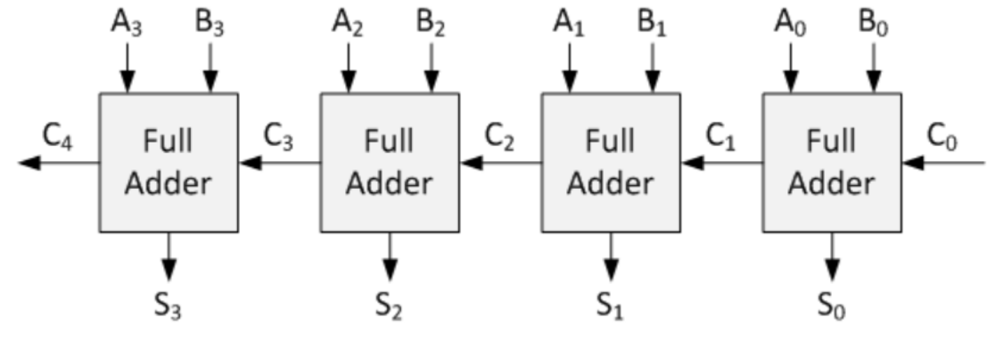
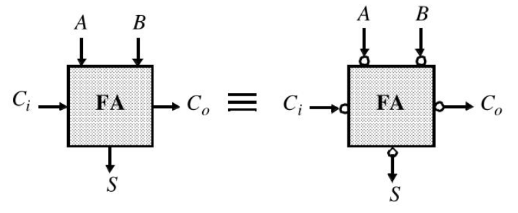
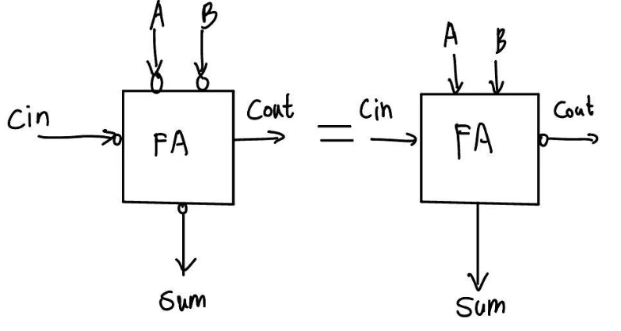
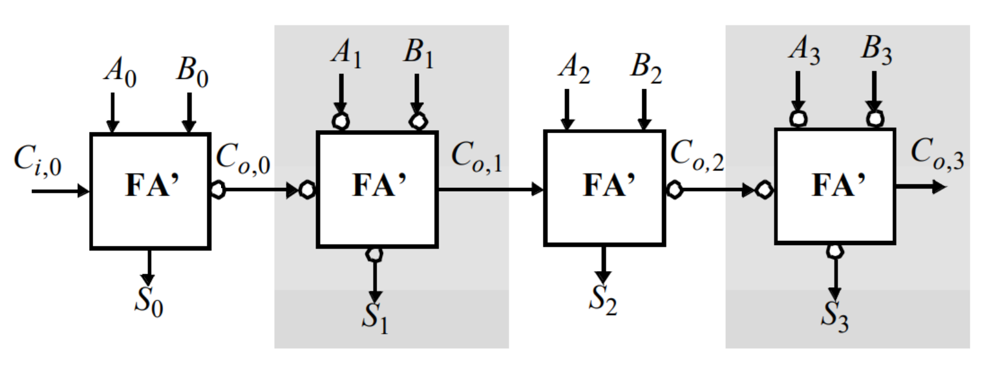
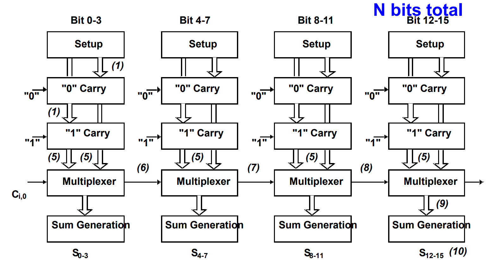
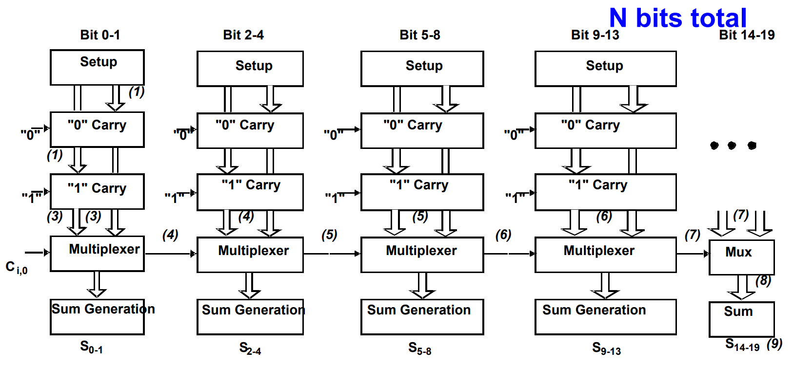

# Lec 04 - ALU

## Ripple Carry Adder

The classic ripple carry adder is similar to as follows:

<figure><figcaption></figcaption></figure>

In a ripple carry adder, the delay is computed as follows:

$$
t_{\text{add,ripple-carry}}=（N-1)t_{\text{carry}}+t_{\text{sum}}
$$

where tcarry is the time to generate the Cout in a full adder and tsum is the time to generate the S bit in the fuller adder.


In a full adder, S = A <i class="fa-circle-plus">:circle-plus:</i> B <i class="fa-circle-plus">:circle-plus:</i> Cin while Cout = G + P$$\cdot$$Cin, where G = AB and P = A <i class="fa-circle-plus">:circle-plus:</i> B.


### Inversion Property of Full Adder

The inversion property of the full adder can be seen as the two circuit below have the same functionality.

<figure><figcaption></figcaption></figure>


The small circle in the second circuit means **adding an inverter** there.


This property can be used to optimize the RCA. Bet before that, a small variant of the inversion property can be seen as follows:

<figure><figcaption></figcaption></figure>


These two circuits mean that we **remove on inverter** at Cout, thus the Cout will be the **complemented version** of the original Cout.


Thus, the RCA can be optimized to as follows:

<figure><figcaption></figcaption></figure>

This design will save **N** inverters where is the the **number of bits** for the two operands.

## Carry Bypass Adder

The carry bypass adder is shown as follows:

<figure><figcaption></figcaption></figure>

Its worst case delay can be computed using the following formula:

$$
t_{\text{add,bypass}} = t_{\text{setup}} + M t_{\text{carry}} + (N/M - 1) t_{\text{bypass}} + (M - 1) t_{\text{carry}} + t_{\text{sum}}
$$

* $$t_{\text{setup}}$$: The initialization time. Before any addition happens, the circuit must calculate the Propagate ($$P$$) and Generate ($$G$$) signals for **every bit position**. This happens in **parallel**.
* $$Mt_{\text{carry}}$$: The delay for the carry to ripple through the first block. The carry-in must ripple all the way through the first $$M$$ bits before it hits the first bypass mux.
* $$(N/M - 1)t_{\text{bypass}}$$: The delay for the carry to "skip" over the middle blocks.
  * $$N/M$$ is the total number of blocks.
  * We subtract 1 because we don't skip the first block (we ripple through it).
  * The signal travels through the bypass multiplexers of all these intermediate blocks.
* $$(M - 1)t_{\text{carry}}$$: The delay for the carry to ripple through the last block. Once the carry arrives at the start of the final block, it must ripple through the remaining bits to reach the final Most Significant Bit (MSB). It is $$M-1$$ because the final bit's sum logic is accounted for in $$t_{\text{sum}}$$.
* $$t_{\text{sum}}$$: The final delay to generate the actual Sum output at the very last bit position once the valid carry has arrived.

## Carry Select Adder

### Linear Carry Select

<figure><figcaption></figcaption></figure>

In linear carry select adder, the worst case delay can be calculated as follows:

$$
t_{\text{add}}=t_{\text{setup}}+Mt_{\text{carry}}+\frac{N}{M}t_{\text{mux}}+t_{\text{sum}}
$$

* $$t_{\text{setup}}$$: The fixed overhead time to set up the circuit (Generate/Propagate signals).
* $$M t_{\text{carry}}$$: The time it takes for the ripple carry chains in the first block to resolve a valid result. This is the "start" of the critical path.
* $$(N/M) t_{\text{mux}}$$: The propagation delay through the chain of multiplexers.
  * Since there are $$N$$ bits total and $$M$$ bits per stage, there are $$N/M$$ total stages (blocks).
  * The carry signal must ripple through the selection multiplexer of each stage.
* $$t_{\text{sum}}$$: The time to generate the final Sum output after the last multiplexer has settled.


Instead of waiting, every block $$i$$ speculatively calculates two results simultaneously (assuming $$C_{in}=0$$ and $$C_{in}=1$$).

* Based on the timing diagram, all blocks finish this calculation at $$t = t_{setup} + M \cdot t_{carry}$$ (e.g., $$t=5$$).

The critical path becomes the carry signal selecting the correct pre-calculated value through the chain of multiplexers ($$(N/M) t_{\text{mux}}$$)


### Square-Root Carry Select

<figure><figcaption></figcaption></figure>

Similar to the linear carry select, the worst case delay for the square root carry select adder can be calculated as follows:

$$
t_{\text{add}}=t_{\text{setup}}+Mt_{\text{carry}}+\sqrt{2N}t_{\text{mux}}+t_{\text{sum}}
$$
