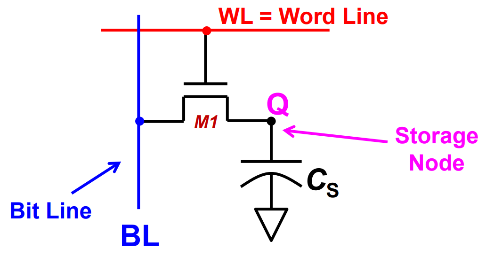
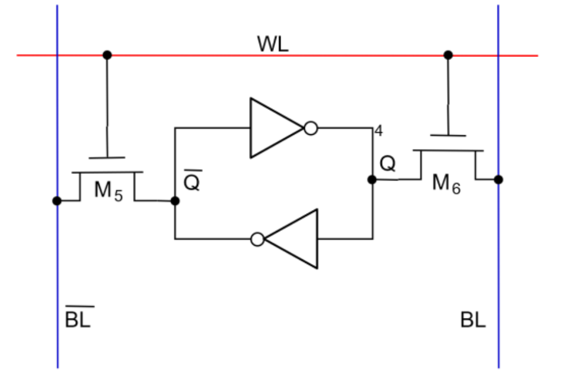
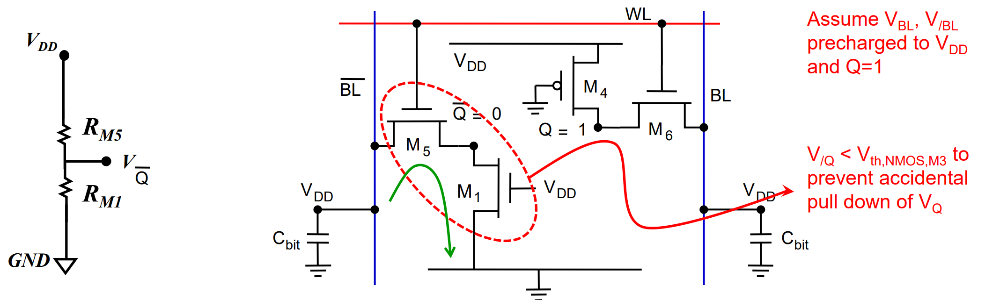
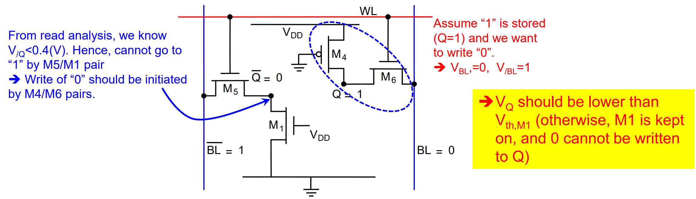
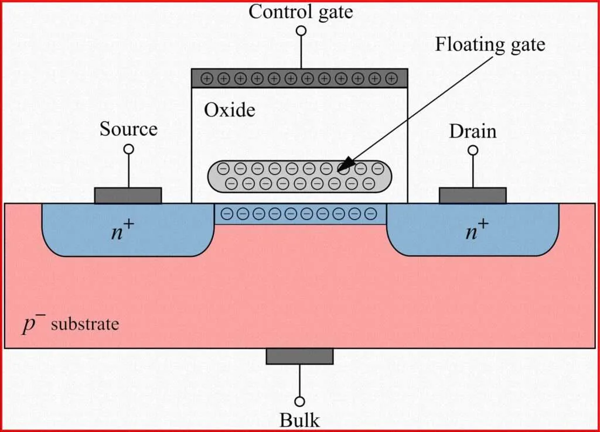
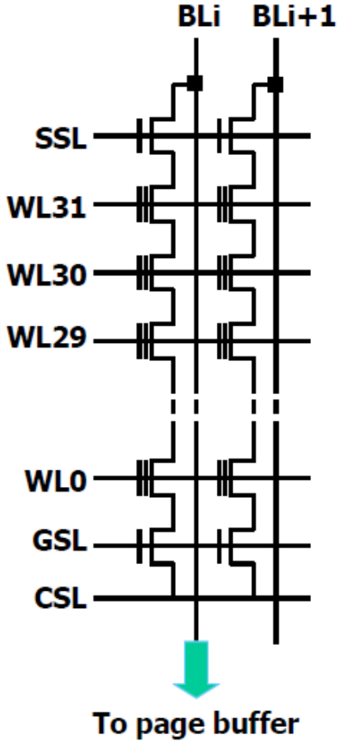

# Lec 05 - Memory

## DRAM

The basic cell used in DRAM is shown as follows:

<figure><figcaption></figcaption></figure>

This structure is known as **1T1C** (One Transistor, One Capacitor). At the end of the Bit Line (BL), we have a **sense amplifier** (we will discuss its usage later).

### Refresh

As we know, DRAM uses a capacitor to store bit information:

1. When the capacitor is charged, a 1 is stored (voltage $$\approx V_{DD}$$).
2. When it is discharged, a 0 is stored (voltage $$\approx 0V$$).

Since the access transistor controlled by the Word Line (WL) cannot isolate the capacitor completely, **leakage current** exists. Consequently, the charge stored in the capacitor will slowly leak away. This is why we need to recharge (refresh) the capacitor periodically.

#### Steps to Refresh

1. **Precharge**: Preload all Bit Lines to $$V_{DD}/2$$.
2. **Access**: Activate one Word Line (only one at a time) $$\rightarrow$$ The NMOS access transistor turns ON.
3. **Charge Sharing**: The sense amplifier at the end of each BL detects the voltage change on the Bit Line caused by the capacitor connecting to it.
   1. If **1** **was** stored: Charge moves from the capacitor to the Bit Line, causing the Bit Line voltage to rise slightly.
   2. If **0 was** stored: Charge moves from the Bit Line to the capacitor, causing the Bit Line voltage to drop slightly.
4. **Sensing & Restoration**: The sense amplifier amplifies this small voltage difference.
   1. If the voltage increased, it pulls the Bit Line up to a constant $$V_{DD}$$. This recharges the capacitor, refreshing the 1.
   2. If the voltage decreased, it pulls the Bit Line down to $$0V$$. This fully discharges the capacitor, refreshing the 0.

### Read

The Read operation in DRAM is **destructive**, meaning the act of reading discharges the cell. Therefore, a "Read" is essentially the same process as the "Refresh" described above. Once the Sense Amplifier has sensed and latched the data (driving the BL to $$0$$ or $$V_{DD}$$), the data is effectively read and restored simultaneously. We simply read the voltage state of the Bit Line.

### Write

To write to a DRAM cell:

1. The row is activated, and the sense amplifiers latch the current values (effectively a refresh/read cycle begins).
2. To write new data, the write driver circuits overpower the sense amplifiers, driving the Bit Lines to the desired value ($$V_{DD}$$ for 1, $$0V$$ for 0).
3. This forces the capacitor to charge or discharge to the new logic level.

Why refresh is needed?

We do not write to every bit cell in a Word Line every time it is accessed. Even if we modify some bits, the remaining cells in that row are activated and connected to the Bit Lines. If the Sense Amplifier did not restore (refresh) their values during this cycle, their stored charge would be lost due to charge sharing. Furthermore, leakage occurs even when rows are not activated, necessitating periodic refresh cycles for the entire array.

## SRAM

We start with the **bistable element**. The following is a classic bistable circuit composed of two cross-coupled inverters. If $$Q$$ is 1,

<figure><figcaption></figcaption></figure>

This bistable element can store 1 bit of information. However, the problem is: how do we write new information into it? To solve this, we add access transistors to build the **6T SRAM** bit cell shown below:

<figure><figcaption></figcaption></figure>

### Read

1. **Precharge**: Precharge both Bit Lines ($$BL$$ and $$\overline{BL}$$) to $$V_{DD}$$.
2. **Access**: Activate the Word Line ($$WL$$) to high. This turns on the access transistors ($$M_5$$ and $$M_6$$)
3. **Sensing:** The internal node storing 0 will pull down the corresponding Bit Line.
   * For example, if $$\overline{Q} = 0$$, it will pull $$\overline{BL}$$ down towards the ground.
   * The other side ($$Q=1$$) will leave $$BL$$ at $$V_{DD}$$.
4. **Output:** A sense amplifier reads the voltage difference between $$BL$$ and $$\overline{BL}$$ to determine the stored bit.

#### Read Stability Constraint

During the read operation, a potential problem arises. The Bit Line is precharged to $$V_{DD}$$, and the internal node $$\overline{Q}$$ is at $$0$$. When the access transistor ($$M_5$$) turns on, it forms a voltage divider with the driver transistor ($$M_1$$).

We must ensure that the voltage at node $$\overline{Q}$$ does not rise high enough to flip the state of the other inverter. The driver ($$M_1$$) must be stronger than the access transistor ($$M_5$$).

<figure><figcaption></figcaption></figure>

We model the transistors as resistors ($$R_{M1}$$ for the driver, $$R_{M5}$$ for the access). Since $$\overline{BL}$$ acts as a voltage source of $$V_{DD}$$, the voltage at node $$\overline{Q}$$ is determined by the voltage divider rule:

$$
V_{\overline{Q}} = V_{DD} \times \frac{R_{M1}}{R_{M1} + R_{M5}}
$$

To prevent the cell from flipping, $$V_{\overline{Q}}$$ must stay below the switching threshold ($$V_{th}$$) of the other inverter ($$M_2/M_4$$):

$$
V_{DD} \times \frac{R_{M1}}{R_{M1} + R_{M5}} < V_{th}
$$

Since we want $$V_{\overline{Q}}$$ to be very low, we require $$R_{M1} \ll R_{M5}$$. In transistor design, resistance is inversely proportional to width ($$W$$). Therefore, the Driver ($$M_1$$) must be wider than the Access ($$M_5$$).

This defines the Cell Ratio (CR):

$$
CR = \frac{(W/L)_{Driver}}{(W/L)_{Access}} = \frac{(W/L)_{1}}{(W/L)_{5}} > 1 \quad (\text{Typically } 1.2 \text{ to } 3)
$$


Read 0 and Read 1 are symmetric, so the CR requirement applies to both sides!


### Write

1. **Drive Bit Lines**: Drive one Bit Line to $$0$$ and the other to $$V_{DD}$$ (depending on the value you want to write).
   * Example: To write a 0 (when $$Q$$ was previously 1), we force $$BL = 0$$ and $$\overline{BL} = 1$$.
2. **Access**: Activate the Word Line ($$WL$$).
3. **Force State**: The access transistor connected to the $$0V$$. Bit Line must overpower the internal PMOS pull-up transistor to flip the cell.

#### Write Ability Constraint

During the write, the access transistor ($$M_6$$) is trying to pull node $$Q$$ down to 0, while the PMOS pull-up transistor ($$M_4$$) is trying to keep it up at $$V_{DD}$$. The access transistor must be stronger.

<figure><figcaption></figcaption></figure>

We model the transistors as a voltage divider between the Access Transistor ($$M_6$$, connected to $$0V$$) and the PMOS Pull-Up ($$M_4$$, connected to $$V_{DD}$$).

$$
V_{Q} = V_{DD} \times \frac{R_{M6}}{R_{M6} + R_{M4}}
$$

To successfully write a 0, we must pull $$V_Q$$ below the switching threshold ($$V_{th}$$) of the inverter ($$M_1/M_3$$) so the feedback loop flips:

$$
V_{DD} \times \frac{R_{M6}}{R_{M6} + R_{M4}} < V_{th}
$$

This implies that $$R_{M6}$$ must be smaller than $$R_{M4}$$ (Access requires lower resistance than Pull-Up). In other words, $$R_{M4}$$ must be very large so that $$V_Q$$ is very low. Therefore, the Access transistor must be stronger (wider) than the PMOS Pull-Up.

This defines the Pull-up Ratio (PR):

$$
PR = \frac{(W/L)_{Pull-up}}{(W/L)_{Access}} = \frac{(W/L)_{4}}{(W/L)_{6}} < 2
$$

## NAND Flash

The building blocks of NAND Flash are the **Floating Gate (FG)** and the **Floating Gate Transistor**. It is essential to understand their working principles before analyzing the NAND Flash architecture.



#### Floating Gate Physics

If a sufficiently strong electric field is applied, the **Fowler-Nordheim (FN) Tunneling** effect occurs: electrons pass through the oxide insulator and get trapped in the conductive floating gate.

Conversely, if a strong electric field is applied in the opposite direction, the electrons are pushed out of the floating gate.



#### Floating Gate Transistor

By placing a floating gate between the control gate and the channel of an NMOS transistor, we create a floating gate transistor.

<figure><figcaption></figcaption></figure>

We can perform the following three operations on the floating gate transistor:

1. **Program (Write 0**): Apply a high programming voltage ($$V_{pgm}$$) to the control gate and $$0V$$ to the substrate. Electrons tunnel into the floating gate and are stored there. This increases the threshold voltage ($$V_{th}$$).
2. **Erase (Write 1)**: Apply a high erase voltage ($$V_{era}$$, usually the same as $$V_{pgm}$$) to the substrate and $$0V$$ to the control gate. This creates an opposite electric field, forcing electrons out of the floating gate. This decreases the threshold voltage.
3. **Read**: We use the shift in threshold voltage ($$V_{th}$$) to determine the state. Apply a reference voltage (usually $$0V$$) to the gate.
   1. **If electrons are present (Programmed/0)**: The negative charge in the FG cancels out the gate voltage. The effective voltage is below the $$V_{th}$$ of the transistor. The device is in **cutoff** (does not conduct).
      * No conduction $$\rightarrow$$ Electrons present $$\rightarrow$$ Read 0.
   2. **If no electrons are present (Erased/1)**: There is no cancellation. The NMOS turns ON.
      * Conduction $$\rightarrow$$ No electrons $$\rightarrow$$ Read 1.



#### SLC/MLC/TLC/QLC

In the section above, the floating gate has only 2 options:

* Has electrons (0)
* No electrons (1)

This is called SLC (Single Level Cell). The other types are:

1. **MLC (Multi-Level Cell)**: 1 floating gate stores 4 states (2 bits).
2. **TLC (Triple-Level Cell)**: 8 states (3 bits).
3. **QLC (Quad-Level Cell)**: 16 states (4 bits).



The circuit diagram for NAND Flash is shown below:

<figure><figcaption></figcaption></figure>

The diagram above represents a **Block**. It is composed of several **Strings**, where each string is connected to one Bit Line.

* **SSL (String Select Line) and GSL (Ground Select Line)** control standard NMOS transistors at the top and bottom of the stack.
* The remaining transistors, controlled by different Word Lines (WLs), are floating gate transistors.
* All floating gate transistors connected to the same Word Line form a **Page**.


Within the same block, all floating gates and NMOS transistors share a common p-substrate (p-well).


### Read

In NAND Flash, read operations are performed at the **Page** granularity.

1. **Select String**: Apply high voltage to SSL and GSL to turn on the selection transistors.
2. **Bypass Unselected Cells**: Apply a Pass Voltage ($$V_{pass}$$) to all _other_ Word Lines (the ones we are _not_ reading).
   * Note: $$V_{pass}$$ is a voltage high enough to turn on a transistor regardless of whether its floating gate is charged (programmed) or empty (erased), but not high enough to trigger tunneling (programming). This turns the unselected cells into "pass-through" wires.
3. **Read Selected Cell**: Apply the read reference voltage ($$0V$$) to the specific Word Line we are reading.
   1. If the Floating Gate has electrons (programmed), the transistor **does not conduct**.
   2. If the Floating Gate is empty (erased), the transistor **conducts**.
4. **Sense**: The sense amplifiers detect if current flows through the string (Bit Line voltage drops) or not (Bit Line stays high).

### Write

Writing (Programming) is also performed at the **Page** granularity. Note that we can only program **1s to 0**s. To turn 0s back to 1s, we must Erase (see below).

1. **Setup**: Apply high voltage to SSL (to connect the string to BL) and $$0V$$ to GSL (to disconnect from ground).
2. **Data Setup**: Set the Bit Lines based on the data to be written:
   * **To Write 0 (Program)**: Set Bit Line to 0V. This creates a high potential difference between the Gate and the Channel, allowing tunneling.
   * **To Write 1 (Inhibit)**: Set Bit Line to $$V_{DD}$$. This raises the channel potential, reducing the voltage difference between the Gate and Channel so that tunneling _does not_ occur (Program Inhibit).
3. **Pass Voltage**: Apply $$V_{pass}$$ to the unselected Word Lines (to pass the Bit Line voltage down the string).
4. **Program Voltage**: Apply the Programming Voltage ($$V_{pgm}$$, a very high voltage, e.g., 20V) to the specific Word Line we are writing to.
   * **If BL is 0V**: Electrons tunnel into the floating gate $$\rightarrow$$ Write 0.
   * **If BL is High**: No tunneling occurs $$\rightarrow$$ State remains 1.

### Erase

Erase operations in NAND Flash are performed at the **Block** granularity (you cannot erase just one Page).

1. **Apply Erase Voltage**: Apply a high Erase Voltage ($$V_{era}$$) to the common substrate (p-well).
2. **Ground Gates**: Set all Word Lines (control gates) in the block to $$0V$$.
3. **Result**: Electrons in the floating gates are attracted to the substrate (tunneling out of the FG) due to the strong electric field. All cells in the block are reset to 1.
