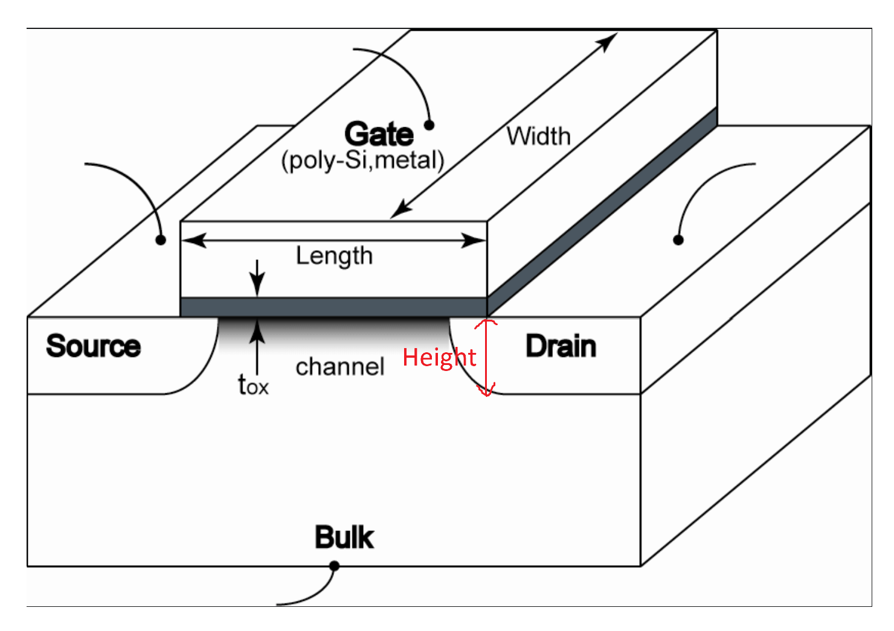

# Tutorial 1

## Problems



### 01. Delay Calculation

This is pretty straight-forward. Just two small tips

> 1. tpHL is regarding the Vout, so we look at the difference between the **10% point** and **90% point** of the **falling edge** of Vout.
> 2. Give a waveform, to find its **period**, we look at the difference **50% point** of the **falling edge** and the **rising edge**.&#x20;

### 02. On Resistance

When the MOSFET transistor operates in the linear region, it behaves like a **voltage-controlled resistor**, thus it can be modelled as having an **on resistnace**. And recall that in secondary school, we use the following formula to define the resistance,

$$
R=\rho\frac{L}{A}=\rho\cdot\frac{L}{H\times W}
$$


To refresh your secondary school physics knowledge, the measurement formula for resistance is: $$R=\frac{V}{I}$$, where $$V$$ is the voltage across the resistor and $$I$$ is the current flowing through the resistor.


So, to know the on resistance of a MOSFET transistor, we need to know what the **H**eight, **L**ength and **W**idth is in our MOSFET.

<figure><figcaption></figcaption></figure>

Unfortunately, in the above formula $$\rho, L$$ and $$H$$ are all **constant** after manufacturing. We can only change the width of the transistor to change its resistance, this is called the **sizing approach.** Knowing this, our problem becomes easier, we just need to

1. fix the NMOS width, and calculate the PMOS width, or
2. fix the PMOS width and calculate the NMOS width.

Food for though about \rho_n and \rho_p

Using the information given in this problem, as well as the formula, we can find that $$\rho_n:\rho_p\approx2:1$$. This is not something coincidental.

Besides that, the tips from this problem is that

> Same process node (e.g., 65nm, 7nm, etc) means **same minimal length** (usually just the same length in this course) and **same gate-oxide material/thickness**.

### 03. Gate Capacitance

In this topic, the most important equation is as follows,

$$
C_{\text{total}}=\underbrace{\frac{\epsilon_{ox}}{t_{ox}}}_\text{capacitance per unit}\times W\times L=\frac{\epsilon_r\times\epsilon_o}{t_{ox}}\times W\times L
$$

Sometimes, we use $$C_{ox}$$ to denote the capacitance per unit also. Knowing this, the problem will be quite straight forward. And the following is just a small tips

> If we change the gate oxide or gate oxide thickness, the $$t_{ox}$$ will be changed correspondingly.

## Tips

1. tpHL is regarding the Vout, so we look at the difference between the **10% point** and **90% point** of the **falling edge** of Vout.
2. Give a waveform, to find its **period**, we look at the difference **50% point** of the **falling edge** and the **rising edge**.&#x20;
3. Same process node (e.g., 65nm, 7nm, etc) means **same minimal length** (usually just the same length in this course) and **same gate-oxide material/thickness**.
4. If we change the gate oxide or gate oxide thickness, the $$t_{ox}$$ will be changed correspondingly.
